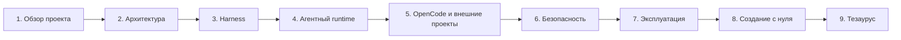

# Документация Ionic LLM Boilerplate

Это точка входа в документацию универсального стартового репозитория для разработки гибридных мобильных приложений при помощи локальной LLM. Основной предмет документации — **harness**, то есть управляющая программная система вокруг модели: она подбирает знания, формирует запрос, ограничивает инструменты, изолирует изменения и проверяет результат.

> Если термин незнаком, наведите указатель на подчёркнутое сокращение или откройте [тезаурус](glossary.md). Например: <abbr title="Large Language Model — большая языковая модель">LLM</abbr>, <abbr title="Retrieval-Augmented Generation — добавление найденного контекста к запросу модели">RAG</abbr>, <abbr title="изолированная рабочая копия Git">worktree</abbr>.

## Как читать документацию

Материалы образуют связанный маршрут, но каждый раздел можно использовать отдельно.

## Маршруты для разных читателей

| Кто вы                           | С чего начать                                       | Что читать дальше                                                                                                                             |
| -------------------------------- | --------------------------------------------------- | --------------------------------------------------------------------------------------------------------------------------------------------- |
| Разработчик Angular/Ionic        | [Быстрый старт](getting-started.md)                 | [Архитектура](architecture.md), [ежедневная эксплуатация](operations.md)                                                                      |
| Разработчик harness              | [Что такое harness](harness/README.md)              | [извлечение контекста](harness/context-retrieval.md), [протокол модели](harness/model-protocol.md), [оценка качества](harness/evaluations.md) |
| Инженер платформы или DevOps     | [Архитектура](architecture.md)                      | [безопасность](security.md), [deployment и hardening](deployment-and-hardening.md)                                                            |
| Автор собственной агентной среды | [Инструкция по созданию](build-your-own-harness.md) | [agent runtime](agent/README.md), [политика инструментов](agent/tools-and-policy.md)                                                          |
| Руководитель или новый участник  | [Обзор проекта](project-overview.md)                | [презентация](presentation/ionic-llm-harness-overview.pptx), [тезаурус](glossary.md)                                                          |

## Карта материалов

- [Обзор проекта](project-overview.md) — назначение, границы, стек и готовые сценарии.
- [Быстрый старт](getting-started.md) — установка, подключение модели, первый вопрос и первая агентная задача.
- [Архитектура](architecture.md) — компоненты системы, доверительные границы и потоки данных.
- [Harness](harness/README.md) — понятие, состав и отличие от LLM и агента.
  - [Использование в существующих проектах](harness/using-with-existing-projects.md) — пошаговая установка, подключение, запуск, review и обновление общего harness.
  - [Внешние проекты и OpenCode](harness/external-projects-and-opencode.md) — один установленный harness, MCP-инструменты, внешние worktree и human-only применение патча.
  - [Обязательные skills](harness/required-skills.md) — user-scope packages, команды установки и trust allowlist.
  - [Покрытие skills](harness/skill-coverage.md) — SCSS, native debugging, testing, security, delivery и остальные этапы lifecycle.
  - [Visual debugging](harness/visual-debugging.md) — текущие ограничения и спецификация DOM/screenshot/image-diff расширения.
  - [Извлечение контекста](harness/context-retrieval.md) — skills, маршрутизация, chunking, ranking и бюджеты.
  - [Протокол модели](harness/model-protocol.md) — OpenAI-compatible API, сообщения, tool calls и обработка ответов.
  - [Оценка качества](harness/evaluations.md) — eval-задачи, метрики и регрессионный цикл.
- [Agent runtime](agent/README.md) — цикл «модель → инструмент → наблюдение → проверка».
  - [Инструменты и политика](agent/tools-and-policy.md) — реестр возможностей и контроль путей.
  - [Executors, approvals и Agent API](agent/executors-approvals-api.md) — Docker isolation, pause/resume и безопасная удалённая точка входа.
  - [Worktree и валидация](agent/worktrees-and-validation.md) — изоляция изменений, проверки и применение патча.
  - [Обособление, состояние и контроль качества](agent/isolation-state-validation.md) — единое подробное объяснение Git worktree, сохраняемого состояния, точечных одобрений, шести стадий проверки и 18 тестов harness.
- [Безопасность](security.md) — модель угроз, секреты, prompt injection, sandbox и журналы.
- [Эксплуатация](operations.md) — команды, конфигурация, диагностика и разбор проблем.
- [OpenCode](opencode.md) — подключение OpenCode к удалённой `gpt-oss-20b` через существующий local env.
- [Deployment-тестирование и hardening](deployment-and-hardening.md) — безопасное удалённое размещение и тесты контура.
- [Как создать такой harness самостоятельно](build-your-own-harness.md) — подробное руководство от пустого репозитория до управляемого агента.
- [Тезаурус](glossary.md) — определения терминов простым языком.
- [Презентация](presentation/ionic-llm-harness-overview.pptx) — краткое визуальное введение в основные функции.

## Что является источником истины

Документация объясняет реализацию, но исполняемая конфигурация имеет приоритет:

| Область                          | Источник истины                                                                           |
| -------------------------------- | ----------------------------------------------------------------------------------------- |
| Модель, skills и retrieval       | [`ai/harness.json`](../ai/harness.json)                                                   |
| Агентные лимиты, пути и проверки | [`ai/agent.json`](../ai/agent.json)                                                       |
| Проверки внешнего mobile-проекта | [`ai/profiles/angular-ionic-capacitor.json`](../ai/profiles/angular-ionic-capacitor.json) |
| Поведение модели                 | [`ai/prompts/system.md`](../ai/prompts/system.md)                                         |
| Контракт агента                  | [`ai/prompts/agent.md`](../ai/prompts/agent.md)                                           |
| Подключение OpenCode             | [`scripts/opencode/run.mjs`](../scripts/opencode/run.mjs)                                 |
| Внешний MCP runtime              | [`scripts/harness/`](../scripts/harness/)                                                 |
| Реальная логика harness          | [`scripts/local-ai/`](../scripts/local-ai/)                                               |
| Реальная логика агента           | [`scripts/agent/`](../scripts/agent/)                                                     |
| Внешний state/MCP runtime        | [`scripts/harness/`](../scripts/harness/)                                                 |
| Команды проекта                  | [`package.json`](../package.json)                                                         |

Если документация и код расходятся, исправлять нужно либо код, либо документацию — но не скрывать расхождение. Команда `npm run docs:check` проверяет локальные ссылки, а `npm run verify` включает её в общий контроль качества.

---

Далее: [обзор проекта →](project-overview.md)
