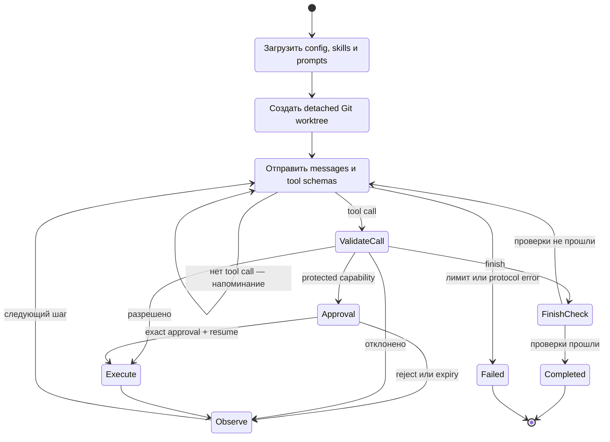

# Controlled coding-agent runtime

[Документация](../README.md) · [Архитектура](../architecture.md) · [Инструменты](tools-and-policy.md) · [Executors и API](executors-approvals-api.md) · [Worktree](worktrees-and-validation.md) · [Обособление и проверки](isolation-state-validation.md) · [Безопасность](../security.md)

## Что делает runtime агентным

Обычная LLM принимает текст и возвращает текст. Агентный runtime повторяет управляемый цикл:

1. модель выбирает следующий инструмент;
2. controller проверяет и исполняет вызов;
3. результат возвращается модели как observation;
4. модель выбирает следующий шаг;
5. цикл заканчивается только после `finish` и обязательной проверки либо после исчерпания лимита.

## Основные компоненты

| Компонент                                              | Ответственность                                            |
| ------------------------------------------------------ | ---------------------------------------------------------- |
| [`run.mjs`](../../scripts/agent/run.mjs)               | CLI parsing и user-facing итог                             |
| [`runtime.mjs`](../../scripts/agent/lib/runtime.mjs)   | Жизненный цикл run, сообщения, tool loop и finish          |
| [`protocol.mjs`](../../scripts/agent/lib/protocol.mjs) | Tool schemas и нормализация model response                 |
| [`tools.mjs`](../../scripts/agent/lib/tools.mjs)       | Реализация разрешённых операций и check runner             |
| [`executor.mjs`](../../scripts/agent/lib/executor.mjs) | Выбор Local/Docker execution boundary                      |
| [`approval.mjs`](../../scripts/agent/lib/approval.mjs) | Exact approvals с TTL и защищённым хранением               |
| [`state.mjs`](../../scripts/agent/lib/state.mjs)       | Сохраняемое состояние для pause/resume                     |
| [`api.mjs`](../../scripts/agent/api.mjs)               | Token-protected loopback Agent API                         |
| [`policy.mjs`](../../scripts/agent/lib/policy.mjs)     | Нормализация путей, glob policy и проверка diff            |
| [`worktree.mjs`](../../scripts/agent/lib/worktree.mjs) | Изоляция Git, журнал событий, получение и применение patch |
| [`config.mjs`](../../scripts/agent/lib/config.mjs)     | Загрузка и проверка `ai/agent.json`                        |
| [`doctor.mjs`](../../scripts/agent/doctor.mjs)         | Проверка Git, ripgrep, prompts и process isolation         |

## Подготовка запуска

До первого model request runtime:

- проверяет непустую задачу;
- загружает и валидирует agent config;
- загружает connection config и разрешает точный model ID;
- собирает trusted skill context без project reference;
- соединяет agent contract, domain rules и skill context;
- требует чистую primary working copy;
- создаёт run directory и worktree;
- записывает событие `run_started`.

Важно: агент не получает application code заранее. Он обязан начать с инструментов исследования. Это уменьшает prompt, предотвращает неявную утечку всего репозитория и оставляет чтение наблюдаемым.

## Tool loop

Модель видит JSON schemas семи tools. Native tool calls предпочтительны, строгий JSON content поддерживается как fallback. Parallel tool calls отключены, поэтому изменения происходят в предсказуемой последовательности.

Для каждого вызова controller:

1. увеличивает глобальный счётчик tool calls;
2. отклоняет malformed arguments;
3. отличает controller-only `finish` от обычных handlers;
4. исполняет handler внутри worktree;
5. обрезает слишком большой output;
6. записывает безопасное событие в JSONL log;
7. возвращает результат модели.

Максимум по умолчанию — 16 итераций и 40 вызовов инструментов. Лимиты предотвращают бесконечный цикл и неконтролируемый расход inference.

## Завершение

`finish` — не просто текст «готово». Это controller-only capability:

- summary должен быть непустой строкой;
- если изменений нет, run может завершиться без build;
- если изменения есть, запускается `requiredFinishCheck`, сейчас `full`;
- только успешная проверка разрешает завершение;
- с `--apply` controller переносит patch в всё ещё чистую primary copy;
- без `--apply` worktree сохраняется для ревью.

Если проверка падает, structured result возвращается модели, и она может сделать bounded repair в оставшихся iterations.

## Журнал событий

Каждый run получает `.agent/runs/<run-id>/events.jsonl` с mode `0600`. События включают:

- start metadata;
- model responses и выбранные tools;
- tool results;
- finish validation;
- successful completion или failure.

Журнал может содержать task text, model content, diffs и build output. Поэтому `.agent/` игнорируется Git, а logs нужно считать чувствительными локальными артефактами. Для production следует добавить retention, redaction и централизованную audit policy — см. [deployment-hardening](../deployment-and-hardening.md).

## Флаги CLI

| Флаг                       | Что меняет                                                   | Чего не меняет                                    |
| -------------------------- | ------------------------------------------------------------ | ------------------------------------------------- |
| `--apply`                  | Применяет успешно проверенный patch к primary copy           | Не расширяет allowed paths                        |
| `--allow-protected`        | Широкий bypass approval для доверенного local maintenance    | Не открывает denied paths                         |
| `--executor local\|docker` | Выбирает execution boundary; default — Docker                | Не меняет path policy                             |
| `--allow-host-execution`   | Явно разрешает check commands без поддерживаемого OS sandbox | Не делает host execution безопасным автоматически |
| `--max-iterations N`       | Меняет лимит run в диапазоне 1–100                           | Не меняет tool-call budget                        |

## Является ли это полноценной агентной средой

Это **полноценная однопользовательская controlled coding-agent environment**: есть perception через tools, planning модели, action, observation, сохраняемая memory, Docker isolation, validation, pause/resume approvals и защищённая API-точка входа.

Для production-grade multi-user среды пока нужны дополнительные уровни:

- отдельная identity и authorization service;
- queue, concurrency limits и resource quotas;
- централизованные metrics/traces с redaction;
- signed artifacts и provenance;
- deployment evals, canary и rollback;
- lifecycle/retention для worktrees и logs.

Эти шаги описаны в [deployment-тестировании и hardening](../deployment-and-hardening.md).

---

← [Evaluations](../harness/evaluations.md) · [Документация](../README.md) · Далее: [tools и policy →](tools-and-policy.md)
