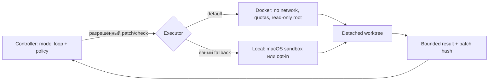
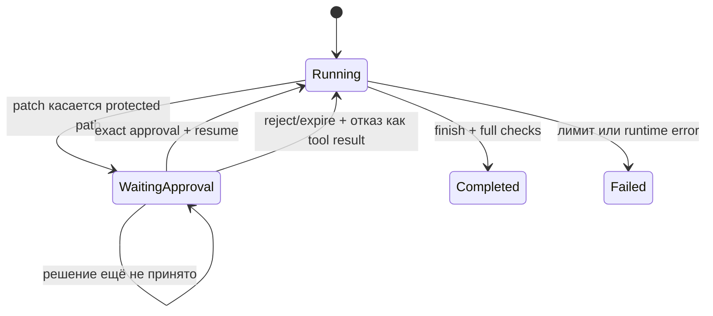

# Executors, resumable approvals и Agent API

[Agent runtime](README.md) · [Tools и policy](tools-and-policy.md) · [Worktree](worktrees-and-validation.md) · [Deployment-hardening](../deployment-and-hardening.md)

Связанное подробное объяснение жизненного цикла, состояния, одобрений и двух уровней проверки: [обособление, состояние и контроль качества](isolation-state-validation.md).

Этот слой отделяет **решение** от **исполнения**. Controller общается с моделью, хранит состояние и проверяет policy. Executor получает только уже разрешённую операцию: применить конкретный patch или запустить именованный профиль проверок.



## Зачем нужен интерфейс Executor

Без него `runtime.mjs` одновременно решал бы, что разрешено, и запускал бы процессы на машине. Такое смешение трудно тестировать и опасно расширять. Теперь controller не знает деталей `docker run`, а Docker runner не может сам выбрать произвольную команду: он понимает только `apply-patch` и `run-checks <versioned-profile>`.

Реализации находятся в [`scripts/agent/lib/executors/`](../../scripts/agent/lib/executors/):

- **DockerExecutor** — безопасный default для агентных задач;
- **LocalExecutor** — диагностический и development fallback.

## DockerExecutor

Сначала соберите pinned runner image:

```bash
npm run agent:docker:build
npm run agent:doctor
```

Каждая операция создаёт новый контейнер. Контейнер получает bind mount только isolated worktree и read-only mount каталога skills. `.env.local-ai`, home пользователя и Docker socket не монтируются.

Finish profile использует offline `cap config`, а не сетевой поиск latest packages из `cap doctor`. Обычный `npm run verify` по-прежнему запускает полный Doctor на host; sandbox validation остаётся воспроизводимой без egress.

Механические ограничения:

- сеть `none`;
- read-only root filesystem;
- non-root UID/GID текущего пользователя;
- все Linux capabilities удалены;
- `no-new-privileges`;
- лимиты CPU, memory и процессов;
- ограниченный `tmpfs` для `/tmp`;
- writable worktree и отдельный temporary mount;
- минимально собранное окружение без наследования host secrets.

Значения ресурсов и имя image задаются в [`ai/agent.json`](../../ai/agent.json). Docker изолирует build и test execution; controller остаётся снаружи, потому что ему нужен доступ к model endpoint и Git metadata для управления worktree.

LocalExecutor выбирается явно:

```bash
npm run agent -- "задача" --executor local
```

Он использует deny-by-default macOS sandbox, если тот доступен. Без поддерживаемого sandbox запуск checks на host блокируется; `--allow-host-execution` — осознанный escape hatch, а не равноценная production-защита.

## Resumable approval

Protected path больше не требует запускать всю задачу с широким `--allow-protected`. При попытке изменить такой файл controller создаёт approval request и переводит run в `waiting_approval`.



Approval связан с четырьмя величинами:

1. конкретным `runId`;
2. capability `apply_patch`;
3. SHA-256 точного текста patch;
4. отсортированным списком protected paths.

Если изменить хотя бы байт patch, путь или run, старое разрешение не подходит. Pending approval имеет TTL. Файлы состояния и решений лежат под ignored `.agent/` с mode `0600`.

Обычный CLI workflow:

```bash
npm run agent -- "Обнови конфигурацию Capacitor"
npm run agent:status -- <run-id>
npm run agent:approve -- <approval-id> --actor reviewer-name
npm run agent:resume -- <run-id>
```

Для отказа:

```bash
npm run agent:reject -- <approval-id> --actor reviewer-name
npm run agent:resume -- <run-id>
```

После reject или expiry защищённое действие не исполняется. Модель получает структурированный отказ и может предложить безопасную альтернативу либо завершить задачу без этого изменения.

`--allow-protected` сохранён для полностью локального доверенного maintenance-сценария, но удалённый API никогда его не включает.

## Сохраняемое состояние

`.agent/runs/<run-id>/state.json` содержит messages, счётчики, следующий iteration, pending tool request и результат. Поэтому `resume` может выполняться другим процессом после перезапуска CLI. `events.jsonl` остаётся append-only журналом последовательности событий.

Это не распределённая база: один репозиторий предполагает один controller process на run. Для нескольких hosts нужен транзакционный state store и lease/lock, описанные в [deployment-hardening](../deployment-and-hardening.md).

## Loopback Agent API

API позволяет отделённому клиенту создать задачу, проверить состояние, принять approval и продолжить run. Он запускается только при готовом Docker executor и по умолчанию слушает `127.0.0.1`.

Подготовка:

```bash
cp .env.local-ai.example .env.local-ai
# Заполните LOCAL_AI_* и уникальный LOCAL_AGENT_API_TOKEN длиной не менее 32 символов.
npm run agent:docker:build
npm run agent:api
```

Endpoints:

| Метод и path                       | Назначение                                  |
| ---------------------------------- | ------------------------------------------- |
| `GET /health`                      | Минимальная liveness-проверка без task data |
| `POST /v1/runs`                    | Создать Docker run в review-only режиме     |
| `GET /v1/runs/<run-id>`            | Получить безопасное публичное состояние     |
| `GET /v1/runs/<run-id>?patch=1`    | Добавить patch завершённого run             |
| `POST /v1/approvals/<approval-id>` | Передать `approved` или `rejected`          |
| `POST /v1/runs/<run-id>/resume`    | Продолжить run после решения                |

Все `/v1/*` endpoints требуют `Authorization: Bearer <token>`. API ограничивает body и число одновременных runs, не принимает remote-флаги `apply`, `allowProtected` или host execution и не возвращает prompt transcript.

Пример создания задачи с placeholder URL:

```bash
curl -sS -X POST "https://agent-gateway.example/v1/runs" \
  -H "Authorization: Bearer $LOCAL_AGENT_API_TOKEN" \
  -H "Content-Type: application/json" \
  --data '{"task":"Добавь доступное пустое состояние","maximumIterations":12}'
```

Не публикуйте встроенный HTTP server напрямую в недоверенную сеть. Для удалённого доступа оставьте loopback binding и поставьте перед ним TLS gateway, VPN или защищённый tunnel с отдельной identity/rate-limit политикой. Non-loopback bind требует явного `LOCAL_AGENT_API_ALLOW_REMOTE=1`, но этот флаг сам по себе не добавляет TLS.

## Что ещё остаётся до multi-user production

Реализован безопасный однопользовательский baseline, но не multi-tenant control plane. Для него по-прежнему нужны OIDC/mTLS identity, repository authorization, durable queue и transactional state, per-tenant quotas, container image digest/signing, seccomp-профиль, централизованная redaction/retention, artifact provenance, deployment canary и rollback.

---

← [Tools и policy](tools-and-policy.md) · [Документация](../README.md) · Далее: [worktree и validation →](worktrees-and-validation.md)
