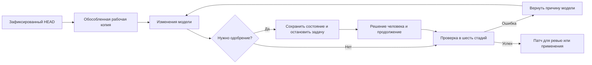

# Обособление, состояние и контроль качества

[Agent runtime](README.md) · [Worktree и валидация](worktrees-and-validation.md) · [Executors и approvals](executors-approvals-api.md) · [Безопасность](../security.md)

Эта глава связывает четыре механизма, которые часто ошибочно воспринимают как одну общую «песочницу»: обособленную рабочую копию Git, сохраняемое состояние задачи, точечные одобрения и два уровня автоматической проверки. У каждого механизма своя граница ответственности.



## 1. Обособленная рабочая копия Git

### Что такое Git worktree

Git worktree — дополнительная рабочая директория того же репозитория. Она использует общую базу объектов Git, но имеет собственный набор файлов и собственное состояние индекса. Это быстрее и экономнее полного клонирования.

Перед агентной задачей controller требует чистую основную рабочую копию. Проверяются в том числе неотслеживаемые файлы. Если разработчик оставил незакоммиченные изменения, запуск завершается до обращения к модели. Это предотвращает смешивание работы человека и агента.

Затем создаются:

```text
.agent/worktrees/<run-id>  — рабочая копия агента
.agent/runs/<run-id>       — состояние и журнал запуска
```

Рабочая копия создаётся командой, эквивалентной:

```bash
git worktree add --detach .agent/worktrees/<run-id> HEAD
```

`--detach` означает, что рабочая копия зафиксирована на текущем committed `HEAD` и не прикреплена к основной ветке. Промежуточные изменения агента не двигают `main` и не попадают в основную директорию проекта.

### Как изменения проходят через worktree

1. Модель исследует только разрешённые файлы через структурированные tools.
2. Модель предлагает стандартный unified Git diff.
3. Controller проверяет размер, пути, типы файлов и количество изменений.
4. Executor выполняет `git apply --check`, а затем применяет патч в worktree.
5. Новые файлы отмечаются `git add --intent-to-add`, чтобы они были видны в итоговом diff.
6. После успешных проверок worktree сохраняется для ревью.
7. Основная рабочая копия меняется только при явном `--apply`; перед переносом controller ещё раз требует чистое состояние и повторяет `git apply --check`.

Без `--apply` результат остаётся в `.agent/worktrees/<run-id>`. Это рекомендуемый режим: разработчик сначала изучает `git status`, `git diff --stat` и полный `git diff`, а затем принимает решение.

### Практическая польза и границы

- Ошибка модели не портит незавершённую работу разработчика.
- Каждая задача получает отдельный проверяемый diff.
- Неудачную попытку можно удалить вместе с её worktree.
- Результат можно оставить для ручного ревью, не касаясь основной ветки.
- Точный патч связывается с результатами проверок через SHA-256.

Git worktree обеспечивает логическое обособление изменений, но не является полноценной границей безопасности процессов. Запрет сети, ограничения ресурсов и доступ к файловой системе обеспечивает DockerExecutor. Жизненный цикл старых worktrees пока очищается вручную.

Источник реализации: [`scripts/agent/lib/worktree.mjs`](../../scripts/agent/lib/worktree.mjs).

## 2. Сохраняемое состояние задачи

Модель не обладает долговременной памятью между процессами. Чтобы задачу можно было остановить и продолжить, controller сохраняет своё состояние в:

```text
.agent/runs/<run-id>/state.json
```

В файл входят:

- исходная задача, модель и тип Executor;
- история сообщений модели и observations инструментов;
- номер следующей итерации и количество вызовов tools;
- режимы `apply`, protected maintenance и host execution;
- пути run directory, журнала и worktree;
- ожидающий tool request и связанное approval;
- результат, validation report или ошибка.

Состояние обновляется после каждого значимого перехода: перед обращением к модели, после ответа, после результата инструмента, при ожидании одобрения, при ошибке и при завершении. Запись выполняется через временный файл и атомарное переименование, а права устанавливаются в `0600`.

Параллельно `events.jsonl` хранит последовательный журнал событий: запуск, ответы модели, tools, результаты, запросы одобрения, полную проверку и завершение. После перезапуска CLI команда `resume` загружает `state.json`, восстанавливает историю и продолжает со следующей итерации.

Это память controller, а не обучение модели. Файл может содержать фрагменты кода, observations и патчи, поэтому `.agent/` исключён из Git и требует политики хранения и очистки.

Текущий файловый механизм рассчитан на один controller на один run. Атомарное переименование защищает файл от частичной записи, но не даёт распределённой блокировки. Для нескольких процессов или серверов нужны SQLite/PostgreSQL, транзакция и lease; это включено в [дорожную карту](../../ai/ROADMAP.md).

Источник реализации: [`scripts/agent/lib/state.mjs`](../../scripts/agent/lib/state.mjs).

## 3. Точечные одобрения

Политика записи делит пути на три класса:

| Класс       | Примеры                                                                                             | Поведение                                                    |
| ----------- | --------------------------------------------------------------------------------------------------- | ------------------------------------------------------------ |
| Разрешённые | `src/**`, `public/**`, `tests/**`, `e2e/**`                                                         | Патч может быть выполнен после обычной проверки policy       |
| Защищённые  | `package.json`, `angular.json`, `capacitor.config.*`, `ai/**`, `scripts/**`, `android/**`, `ios/**` | Run останавливается и требует точного решения человека       |
| Запрещённые | `.env*`, `.git/**`, ключи, сертификаты, signing assets, service credentials                         | Действие блокируется всегда; approval не может его разрешить |

При попытке изменить защищённый путь controller не применяет патч. Он создаёт approval request, сохраняет ожидающий tool call и переводит run в `waiting_approval`.

Approval связан сразу с четырьмя параметрами:

1. конкретным `runId`;
2. capability `apply_patch`;
3. SHA-256 точного текста патча;
4. отсортированным списком защищённых путей.

Текущее время действия — один час. Решение хранит автора и временную метку. Если изменить хотя бы байт патча, добавить путь или использовать решение в другом run, совпадение не пройдёт.

```bash
npm run agent:status -- <run-id>
npm run agent:approve -- <approval-id> --actor reviewer-name
npm run agent:resume -- <run-id>
```

Решение и продолжение являются разными действиями. Поэтому CLI можно перезапустить или выполнить `resume` позже. При отказе или истечении срока защищённое действие не выполняется; структурированный отказ возвращается модели, и она может выбрать безопасный вариант.

В обычном последовательном потоке approval применяется только к сохранённому запросу, после чего pending request очищается. Однако гарантированное exactly-once исполнение при аварии между применением патча и сохранением нового состояния пока не реализовано транзакционно. Это одна из причин перехода на транзакционное хранилище в следующем этапе hardening.

Источник реализации: [`scripts/agent/lib/approval.mjs`](../../scripts/agent/lib/approval.mjs) и [`scripts/agent/lib/runtime.mjs`](../../scripts/agent/lib/runtime.mjs).

## 4. Проверка результата в шесть стадий

Шесть стадий — это не шесть тестов harness. Это последовательный профиль `full`, проверяющий конкретное финальное состояние worktree.

Модель может запускать сокращённые профили `fast` и `build` во время исправлений. Но когда она вызывает controller-only tool `finish`, runtime всегда запускает `requiredFinishCheck`, сейчас это `full`. Если изменений нет, проверка не нужна; если diff существует, завершить run без полного профиля нельзя.

| Стадия | Команда                     | Что проверяет                                                | Практическая польза                                        |
| -----: | --------------------------- | ------------------------------------------------------------ | ---------------------------------------------------------- |
|      1 | `npm run format:check`      | Соответствие Prettier                                        | Убирает форматный шум и нестабильные правки                |
|      2 | `npm run build`             | TypeScript, Angular templates и production build             | Выявляет ошибки типов, импортов, шаблонов и сборки         |
|      3 | `npm test -- --watch=false` | Unit-тесты приложения                                        | Обнаруживает регрессии поведения приложения                |
|      4 | `npm run cap:check`         | Локальная загрузка конфигурации Capacitor через `cap config` | Находит повреждённую конфигурацию без сетевого доступа     |
|      5 | `npm run ai:doctor`         | Toolchain, обязательные файлы, skills и retrieval routes     | Подтверждает, что model harness сохранил работоспособность |
|      6 | `npm run agent:test`        | Policy, protocol, tools, approvals, Executor, runtime и API  | Не позволяет патчу незаметно сломать защитный контур       |

Команды исполняются по порядку и останавливаются на первой ошибке. Controller записывает validation event и возвращает вывод модели как observation. Модель может исправить причину в пределах лимита итераций, после чего профиль начинается заново. Только успешный `full` разрешает статус `completed` и последующее применение патча.

Проверка `cap:check` не заменяет сборки Android и iOS. Нативные сборки требуют отдельных Linux/macOS узлов, эмуляторов или устройств и входят в последующие этапы deployment testing.

Источник конфигурации: [`ai/agent.json`](../../ai/agent.json). Запуск профиля: [`docker/agent-runner.mjs`](../../docker/agent-runner.mjs).

## 5. Восемнадцать автоматизированных тестов harness

Файлы `scripts/agent/tests/*.test.mjs` содержат 18 сценариев. Они проверяют не бизнес-логику приложения, а сам механизм, который управляет моделью.

| Подсистема     | Количество | Сценарии                                                                                                           |
| -------------- | ---------: | ------------------------------------------------------------------------------------------------------------------ |
| Agent API      |          2 | Bearer token и Docker review-only для удалённых runs; отклонение короткого секрета                                 |
| Approvals      |          1 | Защищённое хранение решения и точное совпадение run, capability, hash и paths                                      |
| DockerExecutor |          1 | Нет сети, удалены privileges, включены limits, подключены только явные roots                                       |
| Policy         |          3 | Glob matching; разделение allowed/protected/denied; запрет traversal, rename, symlink, submodule и executable mode |
| Model protocol |          3 | Нормализация OpenAI tool calls; строгий JSON fallback; отклонение truncation и восстановимая ошибка arguments      |
| Agent runtime  |          3 | Проверка iteration limit; полный цикл tools/checks/apply; pause/approve/resume для protected patch                 |
| Tools          |          3 | Read/search/patch/diff; невозможность bypass policy; deny-by-default профиль macOS sandbox                         |
| Git worktree   |          2 | Ревью и явный apply; очистка linked-worktree registration после ошибки setup                                       |
| **Итого**      |     **18** | Контракт управления, исполнения, восстановления и удалённого доступа                                               |

### Когда они выполняются

- `npm run agent:test` запускает набор отдельно;
- `npm run verify` включает его в общий контроль репозитория;
- `full` использует его как шестую стадию при завершении изменённой агентной задачи.

В Docker runner устанавливается `LOCAL_AGENT_SKIP_INTEGRATION=1`. Поэтому два сквозных runtime-теста, которые сами запускают полный agent loop, отмечаются как пропущенные внутри вложенной проверки; остальные 16 выполняются. При обычном `npm run agent:test` без этого флага выполняются все 18.

### Практическая польза

Unit-тесты приложения отвечают на вопрос: «Не сломалась ли функция продукта?» Тесты harness отвечают на другой вопрос: «Не потерял ли агент ограничения и способность доказуемо завершить задачу?»

Они подтверждают, что модель:

- не может записать секреты и служебные данные Git;
- не может выйти из worktree через path traversal или symlink patch;
- не может заменить точный патч после approval;
- не может завершить задачу без controller-driven validation;
- не может использовать удалённый API без токена;
- не получает автоматическое применение результата в remote режиме;
- может остановиться и продолжить после решения человека.

Источник сценариев: [`scripts/agent/tests/`](../../scripts/agent/tests/).

## Краткое различие механизмов

| Механизм          | Что защищает или доказывает                         | Чего не делает                                            |
| ----------------- | --------------------------------------------------- | --------------------------------------------------------- |
| Git worktree      | Отделяет изменения агента от основной рабочей копии | Не изолирует процессы и сеть                              |
| Состояние run     | Позволяет восстановить ход задачи                   | Не является распределённой транзакционной базой           |
| Exact approval    | Разрешает один конкретный защищённый запрос         | Не открывает denied paths и не даёт общего доверия модели |
| Шесть стадий      | Проверяют конкретный финальный diff                 | Не заменяют native deployment tests                       |
| 18 тестов harness | Проверяют контроллер и защитные механизмы           | Не проверяют всю бизнес-логику приложения                 |

---

← [Инструменты и policy](tools-and-policy.md) · [Agent runtime](README.md) · Далее: [безопасность →](../security.md)
