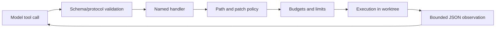
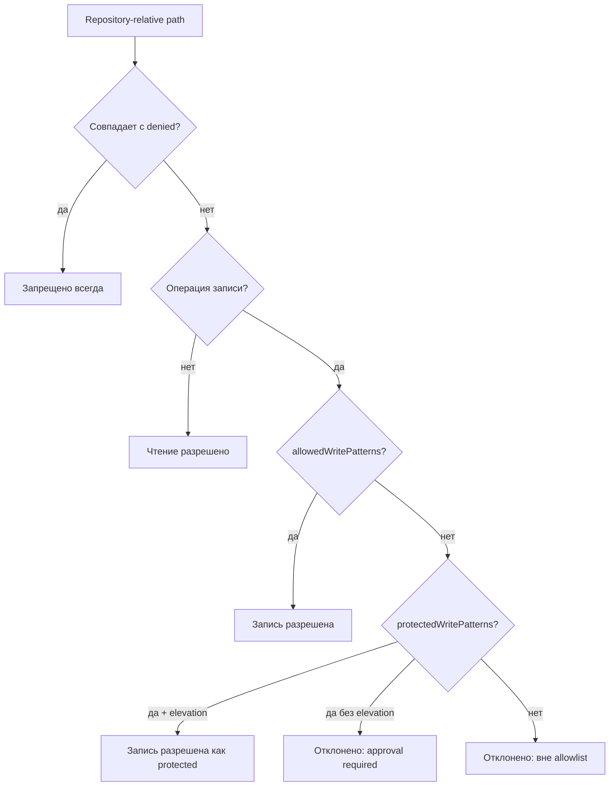

# Инструменты и политика доступа

[Agent runtime](README.md) · [Worktree](worktrees-and-validation.md) · [Безопасность](../security.md) · [Конфигурация](../../ai/agent.json)

## Capability-based подход

Модель не получает терминал. Вместо него controller публикует узкие capabilities — инструменты с JSON schema. Каждый tool умеет ровно одну категорию действий, а его handler повторно проверяет все аргументы.

## Реестр инструментов

| Tool          | Назначение                                | Ключевые ограничения                                                  |
| ------------- | ----------------------------------------- | --------------------------------------------------------------------- |
| `list_files`  | Список читаемых repository files          | denied paths скрыты; limit 1–500                                      |
| `search`      | Fixed-string поиск через `rg`             | denied globs исключены; timeout; limit 1–200                          |
| `read_file`   | Чтение диапазона строк UTF-8 файла        | обычный файл, не symlink/не binary, read byte limit                   |
| `apply_patch` | Применение unified Git diff               | path policy, patch size, file count, mode, no rename/binary/submodule |
| `git_diff`    | Просмотр status и текущего diff           | output truncation                                                     |
| `run_checks`  | Запуск profile `fast`, `build` или `full` | команды только из versioned allowlist                                 |
| `finish`      | Запросить завершение                      | controller запускает mandatory full validation                        |

У `finish` нет обычного handler: runtime обрабатывает его отдельно, поэтому модель не может подменить проверку аргументом.

## Три класса путей

### Allowed write paths

Обычный run может менять application-level каталоги:

- `src/**`;
- `public/**`;
- `tests/**`;
- `e2e/**`.

Это покрывает большинство feature-задач без доступа к инфраструктуре.

### Protected write paths

Конфигурация, prompts, scripts, CI и native projects требуют `--allow-protected`. Среди них `package.json`, Angular/Capacitor configs, `ai/**`, `scripts/**`, `.github/**`, `android/**`, `ios/**`.

Protected означает «разрешается только с явным повышением», а не «опасность исчезла». Такие изменения требуют особенно внимательного human review.

### Denied paths

Denied остаются запрещёнными даже при elevation:

- `.git/**`, `.agent/**` и temporary agent data;
- `.env*`, `.npmrc`, `.netrc`;
- private keys, keystores, provisioning profiles;
- mobile service configs;
- `node_modules`, `dist`, `coverage`;
- Docker credentials directories.

Policy применяет case-insensitive проверку дополнительно к обычной, чтобы снизить риск обхода на разных файловых системах.

## Защита путей

`normalizeRepositoryPath` отклоняет:

- пустые строки и NUL bytes;
- absolute paths;
- `..` и path traversal;
- Windows separators, которые затем нормализуются;
- выход за worktree после `resolve`;
- symlink-компоненты пути и symlink-файлы.

Эта проверка обязательна перед файловой операцией. Нельзя полагаться только на glob match: `src/../.env` внешне начинается с разрешённого каталога, но после нормализации является обходом.

## Защита patch

Модель обязана отправить стандартный Git unified diff. Parser отклоняет:

- patch без `diff --git` headers;
- несовпадающие old/new paths и renames;
- absolute/traversal paths;
- binary patch;
- symlink mode `120000`;
- submodule mode `160000`;
- executable mode, отличный от обычного `100644`;
- patch сверх byte limit;
- изменение более 40 файлов;
- whitespace errors на этапе `git apply --check`.

Сначала выполняется dry-run `git apply --check`, затем реальное применение. Это защищает worktree от частично применённого malformed diff.

## Check profiles

Команды не приходят от модели. Она выбирает только имя профиля:

| Profile | Команды                                                        |
| ------- | -------------------------------------------------------------- |
| `fast`  | format check, unit tests                                       |
| `build` | format check, Angular production build                         |
| `full`  | format, build, tests, Capacitor Doctor, AI Doctor, agent tests |

Каждая команда хранится как массив executable + args, без shell interpolation. Это исключает выполнение строк вроде `npm test && curl ...`, сгенерированных моделью.

## Бюджеты как защита

Agent config ограничивает не только время, но и площадь воздействия:

- 16 iterations;
- 40 tool calls;
- 24 KB output одного инструмента;
- 50 KB чтения одного файла;
- 200 KB patch;
- 40 changed files;
- 10 секунд на search;
- 10 минут на check command.

Лимиты следует настраивать по measured workload. Слишком низкие вызывают ложные остановки, слишком высокие расширяют blast radius и стоимость.

---

← [Agent runtime](README.md) · [Документация](../README.md) · Далее: [worktree и проверки →](worktrees-and-validation.md)
