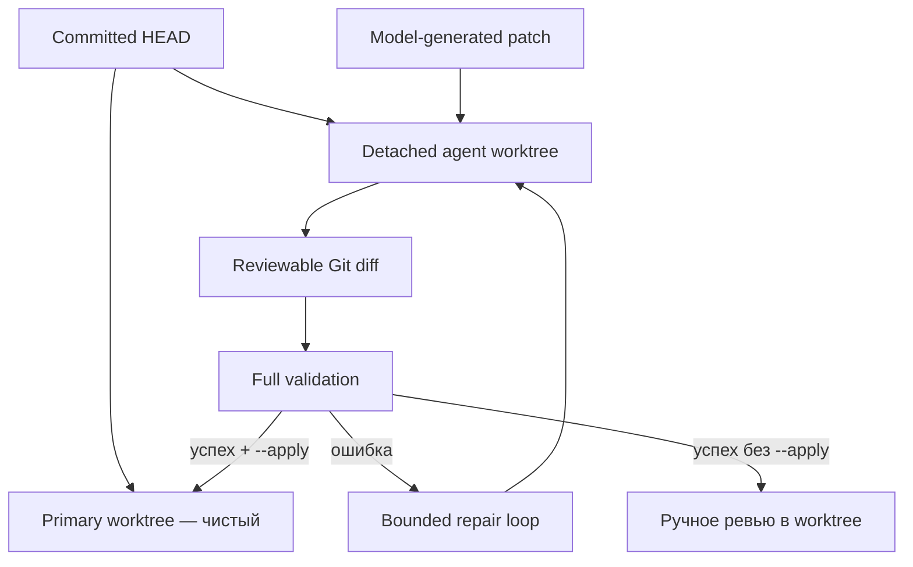
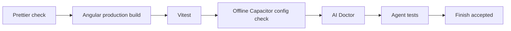

# Git worktrees, проверка и применение результата

[Agent runtime](README.md) · [Tools и policy](tools-and-policy.md) · [Эксплуатация](../operations.md) · [Безопасность](../security.md)

Связанное подробное объяснение жизненного цикла, состояния, одобрений и двух уровней проверки: [обособление, состояние и контроль качества](isolation-state-validation.md).

## Зачем нужен отдельный worktree

Git worktree — дополнительная рабочая копия того же репозитория. Runtime создаёт её из committed `HEAD` в `.agent/worktrees/<run-id>` и работает только там.



Промежуточные ошибки модели не смешиваются с незакоммиченными изменениями пользователя. Поэтому перед запуском `assertCleanWorktree` требует чистую primary copy.

## Lifecycle run

1. Создаётся уникальный `run-id` из timestamp и random suffix.
2. Создаются `.agent/worktrees/<run-id>` и `.agent/runs/<run-id>`.
3. Git добавляет detached worktree от `HEAD`.
4. Для LocalExecutor может создаваться symlink на dependencies; DockerExecutor использует dependencies из runner image.
5. Создаётся `events.jsonl` с правами `0600`.
6. Модель исследует и меняет worktree через tools.
7. Новые файлы отмечаются `--intent-to-add`, чтобы попадать в diff.
8. На `finish` запускается full validation.
9. С `--apply` итоговый patch проверяется и применяется к чистой primary copy.
10. Worktree сохраняется для доказательств и ревью; lifecycle cleanup пока выполняется вручную.

## Почему проверяется patch hash

`run_checks` возвращает SHA-256 текущего patch. Это связывает evidence с конкретным состоянием изменений. Если patch поменялся после проверки, прежний результат больше не доказывает корректность нового состояния.

Текущий runtime при `finish` запускает проверки заново, поэтому успешное завершение относится к финальному diff. В production provenance следует расширить: commit SHA, dependency lock hash, container image digest, platform/toolchain versions и подпись результата.

## Полный validation profile



Pipeline останавливается на первой ошибке. Это уменьшает шум и быстрее возвращает модели первичную причину. После исправления профиль запускается заново с начала.

## Process isolation

Default — [DockerExecutor](executors-approvals-api.md): network отключён, root filesystem read-only, capabilities удалены, заданы CPU/memory/PID/tmp limits, а host secrets не наследуются.

При явном выборе LocalExecutor на macOS runtime пытается использовать `/usr/bin/sandbox-exec` с deny-by-default profile:

- читать можно системные runtime roots, worktree, dependencies и skills;
- писать можно только внутри worktree;
- network access не разрешён profile;
- child processes разрешены для toolchain.

Если sandbox недоступен, checks не запускаются, пока пользователь явно не задаст `LOCAL_AGENT_ALLOW_HOST_EXECUTION=1` или `--allow-host-execution`. Это escape hatch для уже изолированного container/VM, а не рекомендуемый default на workstation.

Современные версии macOS могут не предоставлять `sandbox-exec`. Для надёжного production isolation используйте отдельный container или microVM на run.

## Ревью результата

После run без `--apply`:

```bash
git -C .agent/worktrees/<run-id> status --short
git -C .agent/worktrees/<run-id> diff --stat
git -C .agent/worktrees/<run-id> diff
```

Проверяйте не только зелёные тесты:

- соответствует ли diff исходной задаче;
- нет ли лишних абстракций и dependencies;
- соблюдены ли Angular/Ionic/Capacitor conventions;
- корректна ли accessibility;
- учтены ли Web/Android/iOS differences;
- не ослаблена ли конфигурация безопасности;
- не появились ли секреты или deployment-specific данные.

## Применение вручную

Если результат устраивает, можно создать patch и применить его из primary copy. Сначала убедитесь, что primary copy чистая, затем используйте обычные Git-инструменты. Автоматический `--apply` делает те же основные проверки: получает diff, выполняет `git apply --check`, затем применяет patch.

Не удаляйте worktree до завершения ревью и фиксации нужных evidence. После принятия результата старые runs следует удалять по retention policy, а не бесконечно хранить локально.

## Восстановление после ошибки

| Ситуация              | Что происходит                              | Действие человека                                                  |
| --------------------- | ------------------------------------------- | ------------------------------------------------------------------ |
| Model/API error       | Run помечается failed, worktree сохраняется | Посмотреть event log и endpoint health                             |
| Validation error      | Результат возвращается модели до лимита     | После остановки изучить последний diff/output                      |
| Iteration limit       | Run завершается failed                      | Уменьшить scope задачи или улучшить prompt/context                 |
| Apply не выполнен     | Primary copy остаётся без изменений         | Проверить, была ли она чистой и прошли ли checks                   |
| Setup worktree failed | Runtime пытается удалить регистрацию        | Выполнить `git worktree list`, затем безопасно prune stale entries |

---

← [Tools и policy](tools-and-policy.md) · [Документация](../README.md) · Далее: [безопасность →](../security.md)
