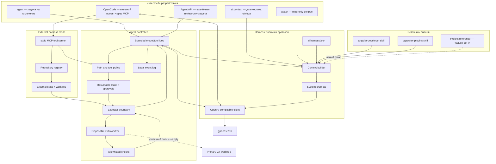
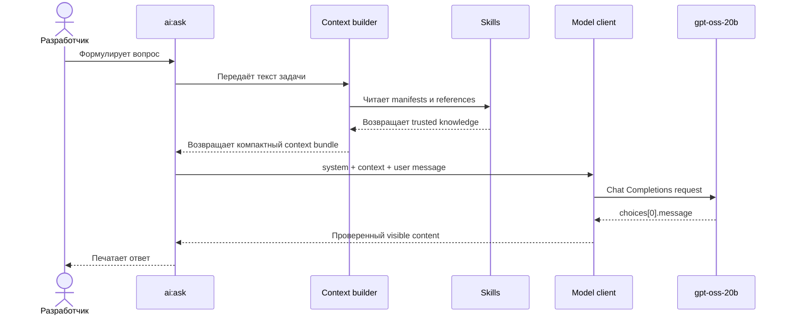
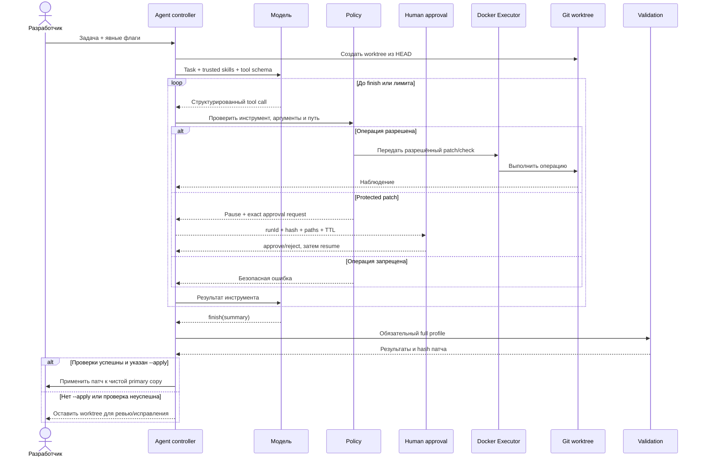
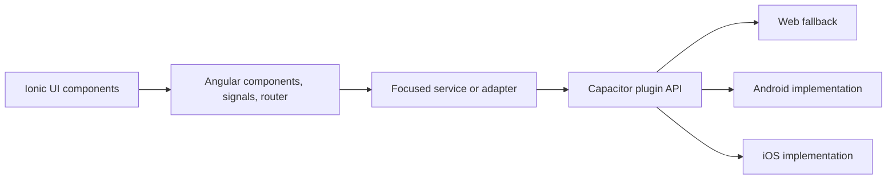

# Архитектура системы

[Документация](README.md) · [Harness](harness/README.md) · [Agent runtime](agent/README.md) · [Безопасность](security.md)

## Архитектура одним взглядом

Система разделена на несколько уровней, чтобы ни модель, ни случайный текст из проекта не получали неявных полномочий.

## Слои и ответственность

### 1. Пользовательские команды

Команды npm образуют стабильный интерфейс для человека и CI:

- `ai:context` — объясняет, что будет добавлено к запросу;
- `ai:ask` — получает ответ без изменения файлов;
- `agent` — запускает управляемый цикл изменения кода;
- `verify` — проверяет состояние репозитория.

Разделение `ai:ask` и `agent` принципиально: просьба «объясни» не должна случайно давать права «измени и запусти».

### 2. Harness: знания и связь с моделью

Harness решает четыре задачи:

1. Загружает только разрешённые skills.
2. Выбирает релевантные reference-фрагменты в пределах бюджета.
3. Собирает системное сообщение с явными доверительными метками.
4. Нормализует обмен с OpenAI-compatible endpoint.

Детали: [введение в harness](harness/README.md), [retrieval](harness/context-retrieval.md), [протокол](harness/model-protocol.md).

### 3. Agent controller: полномочия и цикл

Контроллер получает от модели не shell-текст, а структурированные вызовы из фиксированного реестра. Он проверяет аргументы, пути и бюджеты, исполняет допустимую операцию и возвращает наблюдение модели. Цикл ограничен 16 итерациями и 40 tool calls по текущей конфигурации.

Контроллер остаётся детерминированной доверенной частью системы. Модель — недетерминированный советник внутри его границ.

После policy операции записи и checks передаются через интерфейс Executor. Default DockerExecutor запускает короткоживущий no-network контейнер; LocalExecutor выбирается явно. Protected patch переводит сохраняемое состояние в `waiting_approval`, а не получает широкие полномочия автоматически. См. [executors, approvals и Agent API](agent/executors-approvals-api.md).

### 4. Изолированная рабочая копия

Каждый запуск создаёт detached Git worktree из committed `HEAD`. Это даёт три свойства:

- первичная рабочая копия не загрязняется промежуточными попытками;
- все изменения можно представить единым Git diff;
- применение результата становится отдельным проверяемым действием.

Подробнее: [worktree и валидация](agent/worktrees-and-validation.md).

### 5. OpenCode и внешний MCP harness

Для другого репозитория OpenCode заменяет встроенный model/tool loop и становится единственным reasoning agent. Он запускается из нейтрального внешнего каталога: встроенные read/edit/bash tools запрещены, а целевой project tree доступен только через `iona_*`. MCP server переиспользует те же path policy и Executor, но хранит repository registry, worktrees, runs и approvals вне подключённого проекта. Подробный lifecycle: [внешние проекты и OpenCode](harness/external-projects-and-opencode.md).

## Поток read-only запроса

В этом потоке отсутствуют файловые инструменты. Даже если модель напишет патч или команду, это будет только текст.

## Поток агентной задачи

## Доверительные границы

| Данные или компонент                   | Уровень доверия                   | Почему                                                  |
| -------------------------------------- | --------------------------------- | ------------------------------------------------------- |
| Versioned prompts и JSON policy        | Доверенная конфигурация           | Ревьюится и коммитится человеком                        |
| Allowlisted skill manifests/references | Доверенное предметное руководство | Источники явно перечислены в `ai/harness.json`          |
| Текст задачи пользователя              | Данные задачи                     | Может запрашивать действие, но сам не обходит policy    |
| Файлы проекта                          | Недоверенный reference            | Код и комментарии могут содержать prompt injection      |
| Ответ модели                           | Недоверенное предложение          | Может ошибаться или нарушать формат                     |
| Controller, policy и tool handlers     | Доверенная вычислительная база    | Реально определяют доступные действия                   |
| Вывод build/test инструментов          | Наблюдение                        | Полезен для ремонта, но также ограничивается по размеру |

## Уровень гибридного приложения

Angular отвечает за компоненты, маршрутизацию, состояние и доступность. Ionic даёт mobile-oriented UI и навигационные семантики. Capacitor предоставляет мост к native API.

Нативный вызов должен находиться за узким сервисом или адаптером. Такой слой проверяет платформу, разрешения, доступность API и нормализует ошибки. Это снижает связанность UI с Capacitor и облегчает тестирование.

## Где менять поведение

| Требуется изменить                     | Файл или область                   | После изменения                          |
| -------------------------------------- | ---------------------------------- | ---------------------------------------- |
| Разрешённые skills и retrieval budgets | `ai/harness.json`                  | `npm run ai:doctor`, routing/eval checks |
| System behavior                        | `ai/prompts/system.md`             | smoke + frozen evals                     |
| Agent contract                         | `ai/prompts/agent.md`              | `npm run agent:test`                     |
| Path policy, лимиты, check profiles    | `ai/agent.json`                    | agent tests + threat review              |
| Модельный HTTP-протокол                | `scripts/local-ai/lib/client.mjs`  | unit/smoke tests endpoint                |
| Retrieval algorithm                    | `scripts/local-ai/lib/context.mjs` | retrieval regression suite               |
| Tool behavior                          | `scripts/agent/lib/tools.mjs`      | policy/tool/runtime tests                |
| Worktree lifecycle                     | `scripts/agent/lib/worktree.mjs`   | worktree integration tests               |

---

← [Быстрый старт](getting-started.md) · [Документация](README.md) · Далее: [harness →](harness/README.md)
