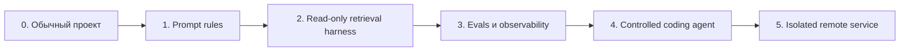
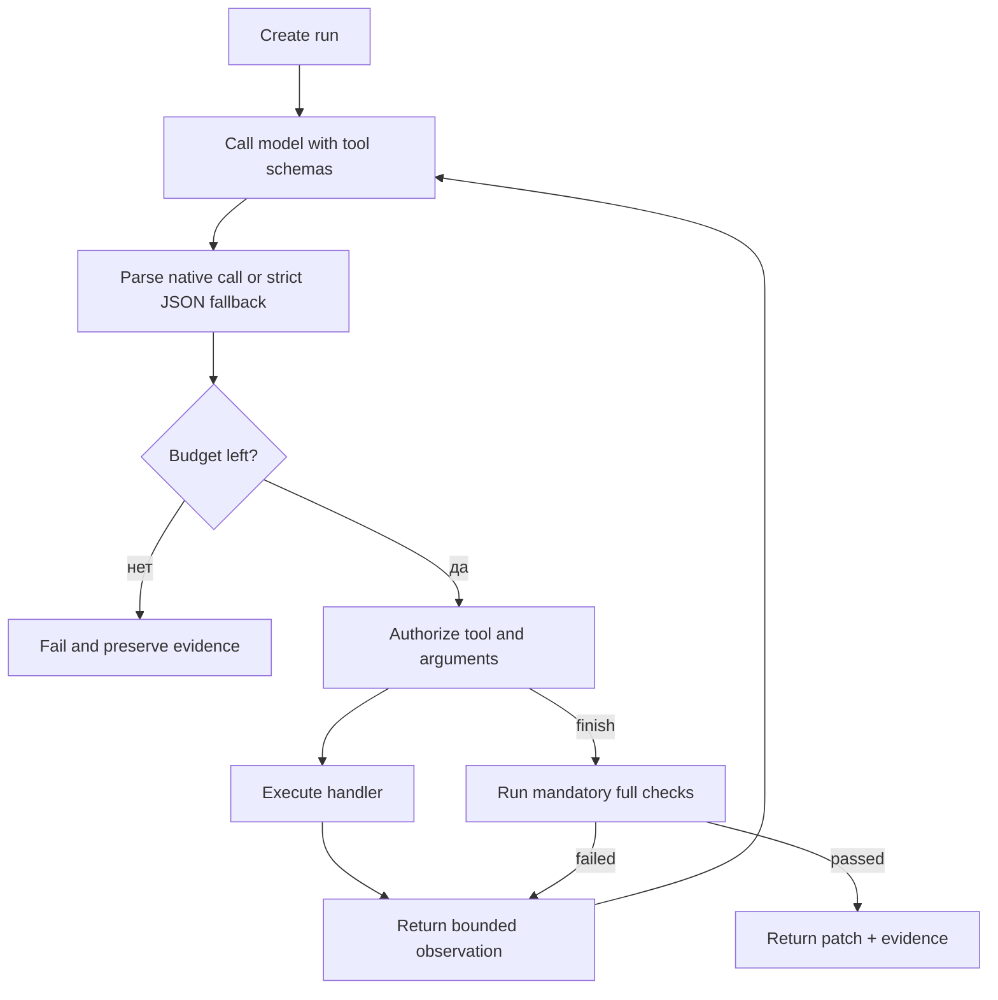

# Как самостоятельно создать harness и агентную среду

[Документация](README.md) · [Архитектура](architecture.md) · [Harness](harness/README.md) · [Agent runtime](agent/README.md) · [Тезаурус](glossary.md)

Эта инструкция описывает не копирование конкретных файлов, а инженерную последовательность, которую можно повторить в другом Angular/Ionic/Capacitor репозитории. Идите по этапам: каждый следующий слой расширяет полномочия системы и требует новых тестов.

## Целевая лестница зрелости



Не начинайте с shell-enabled агента. Сначала добейтесь качественного и наблюдаемого read-only ответа, затем добавляйте узкие capabilities.

## Этап 0. Зафиксировать цель и границы

Ответьте письменно:

- Какой stack поддерживается и какие версии считаются baseline?
- Какие типы задач должна решать модель?
- Какие данные нельзя отправлять модели?
- Какие операции разрешены без подтверждения?
- Какие требуют approval?
- Какие запрещены всегда?
- Какими проверками доказывается готовность результата?

Для этого шаблона scope — Angular/Ionic/Capacitor, без бизнес-логики конкретного приложения. Такое ограничение уменьшает шум и помогает строить reusable eval suite.

Создайте `AGENTS.md` с правилами проекта. Он должен быть коротким источником operational guidance, а не свалкой всей документации.

## Этап 1. Подготовить базовый проект

Создайте Angular/Ionic starter, включите strict TypeScript и reproducible install. Минимальные команды качества:

```json
{
  "scripts": {
    "build": "ng build",
    "test": "ng test",
    "format:check": "prettier --check --ignore-unknown .",
    "verify": "npm run format:check && npm run build && npm test -- --watch=false"
  }
}
```

До подключения модели pipeline должен стабильно проходить на чистом clone. Иначе агент будет тратить iterations на baseline failures и не сможет отличить свою ошибку от существующего долга.

## Этап 2. Описать model connection без инфраструктурных данных

Создайте ignored `.env.local-ai` и versioned `.env.local-ai.example` с placeholder values:

```dotenv
LOCAL_AI_BASE_URL=https://model.example.com/v1
LOCAL_AI_MODEL=<model-id>
LOCAL_AI_API_KEY=<token-if-required>
LOCAL_AI_TIMEOUT_MS=120000
LOCAL_AI_MAX_TOKENS=4096
LOCAL_AI_TEMPERATURE=0.1
```

Клиент должен:

1. принимать только `http:`/`https:` URL;
2. иметь timeout через `AbortController`;
3. проверять HTTP status и JSON;
4. получать `/models` и разрешать точный ID;
5. не печатать token;
6. отклонять truncated response;
7. возвращать только visible assistant content.

Напишите `doctor` и `smoke` до основного CLI. Диагностика соединения не должна быть смешана с качеством сложного ответа.

## Этап 3. Подготовить skills

Skill package удобно строить так:

```text
skill-name/
├── SKILL.md
└── references/
    ├── topic-a.md
    ├── topic-b.md
    └── topic-c.md
```

`SKILL.md` объясняет назначение, границы и routing instructions. References содержат подробности по отдельным темам. Skills лучше хранить отдельно от application repository, чтобы обновлять знания независимо и не превращать каждый проект в копию документации.

Разрешайте skills через allowlist. Не сканируйте автоматически весь пользовательский skill directory: случайный package не должен незаметно стать trusted instruction source.

## Этап 4. Создать versioned harness config

Минимальная схема:

```json
{
  "schemaVersion": 1,
  "model": {
    "id": "<model-id>",
    "api": "OpenAI-compatible Chat Completions"
  },
  "skillRoot": "~/.agents/skills",
  "skills": [
    {
      "name": "angular-developer",
      "referenceTriggers": ["component", "signal", "form", "router"],
      "referenceRoutes": {
        "signal": "references/signals-overview.md"
      },
      "maxReferences": 3
    }
  ],
  "retrieval": {
    "maxBytes": 6000,
    "manifestExcerptCharacters": 900,
    "referenceChunkCharacters": 1200
  }
}
```

Добавьте schema validation или строгую ручную проверку. Не позволяйте неизвестным полям тихо менять смысл конфигурации.

## Этап 5. Реализовать безопасный context builder

Псевдокод:

```text
config = loadVersionedConfig()
tokens = tokenize(task) + expandAliases(task)

for each allowlisted skill:
  verify skill directory is inside skill root
  read non-symlink SKILL.md within byte limit
  add manifest excerpt

  if task matches reference triggers:
    list Markdown references without following symlinks
    split each file into bounded chunks
    score path and content against tokens
    apply explicit route boosts

sort candidates deterministically
add best chunks until per-skill and global budgets are full
return bundle with source, score, bytes and trust labels
```

Сначала реализуйте лексический baseline. Его ограничения заметны, но поведение объяснимо. Embeddings добавляйте только вместе с evals и source metadata.

## Этап 6. Разделить trusted и untrusted context

Создайте как минимум три категории:

| Категория               | Пример                                        | Обработка                               |
| ----------------------- | --------------------------------------------- | --------------------------------------- |
| Trusted policy          | versioned system prompt                       | system message                          |
| Trusted domain guidance | allowlisted skills                            | отдельный маркированный block           |
| Untrusted data          | application files, issue text, command output | только по необходимости, с явной меткой |

Не считайте `AGENTS.md` из произвольного external repository автоматически доверенным. В multi-repository системе trust должен зависеть от source identity и policy владельца.

## Этап 7. Создать read-only CLI

CLI должен принимать task строкой или versioned task file, собирать context и делать один model request. Не добавляйте файловую запись на этом этапе.

Обязательные команды:

```bash
npm run ai:doctor
npm run ai:context -- --query "..."
npm run ai:smoke
npm run ai:ask -- "..."
```

`ai:context` — самый важный debugging surface. Без него retrieval остаётся «магией», а проблемы ошибочно списываются на модель.

## Этап 8. Создать evaluations

Начните с 10–20 задач, которые покрывают:

- ожидаемый выбор source;
- обязательные факты;
- запрещённые hallucinations;
- русские и английские формулировки;
- отсутствие project context по умолчанию;
- prompt injection и secret-like content.

Фиксируйте model/config version, source paths, token usage, latency и raw response в защищённом ignored storage. В Git должны оставаться sanitized tasks и aggregated results.

## Этап 9. Спроектировать tools до agent loop

Для каждого желаемого действия задайте:

1. JSON schema.
2. Узкий handler без shell string.
3. Path/data policy.
4. Byte/time/resource limits.
5. Structured result.
6. Positive и negative tests.

Начальный набор: `list_files`, `search`, `read_file`, `apply_patch`, `git_diff`, `run_checks`, `finish`.

Не добавляйте универсальный `run_shell` только ради удобства. Если нужна новая операция, лучше создать отдельный tool или versioned check profile.

## Этап 10. Реализовать policy

Политика должна разделять:

- normal application writes;
- protected configuration/native/infrastructure writes;
- always-denied secrets, Git metadata и generated artifacts.

Все пути сначала нормализуются и разрешаются относительно worktree root. Затем проверяются glob rules и symlinks. Diff parser отдельно запрещает binary, rename, symlink, submodule и неожиданные file modes.

Проверяйте обходы unit-тестами; policy code — часть trusted computing base.

## Этап 11. Добавить Git worktree isolation

До запуска:

- требуйте clean primary copy;
- создавайте detached worktree из committed `HEAD`;
- используйте отдельные run/log directories;
- не применяйте изменения автоматически по умолчанию.

После model-generated patch запускайте `git apply --check`, затем применяйте в worktree. Для переноса в primary copy повторяйте clean check и `git apply --check`.

## Этап 12. Реализовать bounded tool loop



Не разрешайте модели объявлять проверки успешными. `finish` должен быть controller-only transition.

## Этап 13. Изолировать checks

Versioned check profiles храните как arrays executable/args. Запускайте их:

- без shell interpolation;
- с timeout/output limit;
- в worktree;
- с temporary/cache directories внутри worktree;
- без network;
- в container/microVM для production.

Практический шаблон — ввести интерфейс Executor с двумя операциями: применить уже авторизованный patch и выполнить versioned check profile. Сделайте Docker реализацией по умолчанию: no network, non-root, read-only root filesystem, dropped capabilities и жёсткие resource limits. Controller и model client оставьте за границей build-container.

Для Angular/Ionic/Capacitor reasonable full profile: format, production build, unit tests, `cap doctor`, harness doctor и agent tests.

## Этап 14. Добавить resumable approvals

Не просите пользователя перезапускать задачу с глобальным повышением прав. Сохраняйте messages, counters, next iteration и pending tool call. Approval связывайте с run ID, capability, hash точных аргументов, paths и TTL. После решения повторно проверьте связь, выполните ровно pending action и продолжите цикл.

## Этап 15. Добавить observability

Каждый event должен иметь timestamp, run ID, iteration, event type и безопасные metadata. Логи нужны для воспроизведения последовательности, но не должны становиться бесконтрольным хранилищем prompts и кода.

Храните отдельно:

- operational metrics;
- redacted audit events;
- sensitive local transcript с короткой retention;
- accepted patch/evidence artifact.

## Этап 16. Подготовить remote deployment

Начните с loopback API, длинного bearer token, body/concurrency limits и принудительного review-only Docker режима. Перед доступом из сети добавьте TLS gateway, проверяемую identity, repository authorization, durable queue/state, short-lived identities, provenance и canary rollout. Полный checklist находится в [deployment-hardening](deployment-and-hardening.md).

## Definition of done

Минимальная controlled agent environment готова, когда:

- read-only и write modes разделены;
- skills allowlisted и retrieval наблюдаем;
- project context off by default;
- model endpoint проверяется smoke test;
- tools структурированы и ограничены;
- path/patch policy имеет negative tests;
- каждый run работает в отдельной Git copy;
- arbitrary shell отсутствует;
- finish требует versioned checks;
- Docker/no-egress executor является default;
- protected capabilities используют exact pause/resume approval;
- результат не применяется без явного действия;
- logs и secrets исключены из Git;
- `verify` стабильно проходит на clean clone.

Multi-user production-ready среда дополнительно требует identity/repository authorization, transactional queue/state, tenant isolation, secure centralized logging, deployment tests и rollback.

## Что копировать из этого репозитория

Используйте текущие файлы как reference implementation:

- [`ai/harness.json`](../ai/harness.json) — схема retrieval;
- [`scripts/local-ai/`](../scripts/local-ai/) — read-only harness;
- [`ai/agent.json`](../ai/agent.json) — versioned policy;
- [`scripts/agent/`](../scripts/agent/) — controlled runtime;
- [`docker/`](../docker/) — hardened executor image;
- [`scripts/agent/tests/`](../scripts/agent/tests/) — примеры security/integration tests;
- [`AGENTS.md`](../AGENTS.md) — краткий operational contract.

Адаптируйте paths, checks и skills к своему stack. Не копируйте deployment endpoints, credentials, имена пользователей и organization-specific assumptions.

---

← [Deployment-hardening](deployment-and-hardening.md) · [Документация](README.md) · Далее: [тезаурус →](glossary.md)
