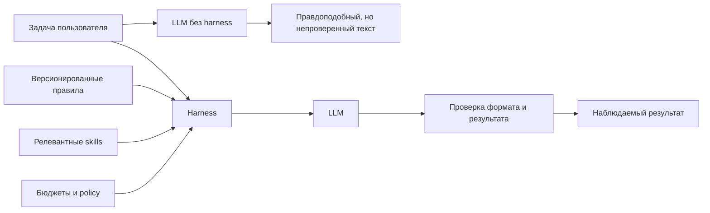

# Harness: управляющий слой вокруг модели

[Документация](../README.md) · [Подключение проектов](using-with-existing-projects.md) · [Архитектура](../architecture.md) · [Skills](required-skills.md) · [Покрытие](skill-coverage.md) · [Visual QA](visual-debugging.md) · [Тест-план](practical-test-plan.md) · [FAQ](faq.md) · [Retrieval](context-retrieval.md) · [Протокол](model-protocol.md) · [Тезаурус](../glossary.md)

## Определение простыми словами

**Harness** — это программная система вокруг LLM, которая превращает «сырую» модель в управляемый компонент разработки. Модель обладает способностью генерировать текст и код, но именно harness задаёт направление, подаёт нужный контекст, ограничивает действия и измеряет результат.

В этом проекте словом harness иногда называют весь инженерный контур, а в узком смысле — read-only слой `scripts/local-ai/`. Чтобы избежать двусмысленности, документация использует такие определения:

- **LLM** — сама языковая модель `gpt-oss-20b`;
- **model harness** — подготовка контекста, prompts, API client и обработка ответа;
- **agent runtime** — цикл инструментов и наблюдений поверх model harness;
- **agent environment** — весь контур: модель, harness, controller, tools, policy, worktree, sandbox, checks и logs.

## Почему одной модели недостаточно

Модель не знает автоматически:

- какие версии Angular/Ionic/Capacitor установлены;
- какие архитектурные правила приняты;
- какой Capacitor plugin предпочесть;
- какие файлы разрешено читать и менять;
- можно ли запускать команду;
- прошёл ли сгенерированный код сборку;
- является ли фрагмент проекта доверенной инструкцией или просто данными.

Без harness ответы зависят только от весов модели и текста пользователя. С harness запрос становится воспроизводимой инженерной процедурой.



## Состав model harness

| Компонент          | Роль                                                        | Реализация                                                                   |
| ------------------ | ----------------------------------------------------------- | ---------------------------------------------------------------------------- |
| Конфигурация       | Фиксирует модель, allowlist skills и retrieval budgets      | [`ai/harness.json`](../../ai/harness.json)                                   |
| Domain prompt      | Описывает технологические правила                           | [`ai/prompts/system.md`](../../ai/prompts/system.md)                         |
| Context builder    | Загружает manifests, ранжирует references, соблюдает бюджет | [`scripts/local-ai/lib/context.mjs`](../../scripts/local-ai/lib/context.mjs) |
| Model client       | Проверяет URL, модель, timeout и вызывает endpoint          | [`scripts/local-ai/lib/client.mjs`](../../scripts/local-ai/lib/client.mjs)   |
| Environment loader | Читает локальную конфигурацию без коммита секретов          | [`scripts/local-ai/lib/env.mjs`](../../scripts/local-ai/lib/env.mjs)         |
| Диагностика        | Проверяет наличие skills и корректность routing             | [`scripts/local-ai/doctor.mjs`](../../scripts/local-ai/doctor.mjs)           |
| Read-only CLI      | Собирает запрос и печатает ответ                            | [`scripts/local-ai/ask.mjs`](../../scripts/local-ai/ask.mjs)                 |
| Frozen tasks       | Делают изменения harness измеряемыми                        | [`ai/evals/tasks/`](../../ai/evals/tasks/)                                   |

## Контракт одного запроса

Harness выполняет последовательность:

1. Проверяет конфигурацию endpoint и model ID.
2. Читает `SKILL.md` только из allowlisted skill directories.
3. Преобразует запрос в набор поисковых токенов и двуязычных aliases.
4. Решает, нужны ли reference-файлы для каждого skill.
5. Делит reference Markdown на компактные chunks.
6. Ранжирует chunks по совпадениям в пути и содержимом, учитывая explicit routes.
7. Помещает лучшие фрагменты в общий byte budget.
8. При явном opt-in добавляет project reference и маркирует его как untrusted.
9. Собирает system message: domain rules + trusted skill context.
10. Отправляет Chat Completions request.
11. Проверяет `finish_reason`, структуру ответа и отсутствие raw service markers.
12. Возвращает только видимый `message.content`.

Подробности шагов 2–8: [извлечение контекста](context-retrieval.md). Шаги 9–12: [протокол модели](model-protocol.md).

## Harness не равен fine-tuning

В текущем проекте модель не «обучается» в смысле изменения весов. Она получает актуальные инструкции во время inference. Это называется **in-context learning** или retrieval-augmented prompting.

| Подход              | Что меняется                    | Когда знания обновляются             | Риск                                          |
| ------------------- | ------------------------------- | ------------------------------------ | --------------------------------------------- |
| Harness + retrieval | Контекст запроса                | Сразу после изменения skill/config   | Контекст может быть выбран неточно            |
| Fine-tuning         | Веса модели                     | После подготовки датасета и обучения | Дорого, знания сложнее обновлять и проверять  |
| Pretraining         | Базовые веса на большом корпусе | После полного цикла обучения         | Очень дорого и не подходит для правил проекта |

Для быстро меняющихся Angular и Capacitor skills retrieval предпочтительнее: источник знания остаётся читаемым, версионируемым и заменяемым. Fine-tuning имеет смысл рассматривать позже для устойчивого формата действий или стиля решения, но не как замену свежей документации.

## Два режима использования

### Read-only консультация

```bash
npm run ai:ask -- "Объясни различия между signal и computed"
```

Результат — текст. Модель не может подтвердить, что код собирается, и не получает tools.

### Агентная задача

```bash
npm run agent -- "Добавь signal-based фильтрацию списка"
```

Здесь тот же model harness становится источником знаний для [agent runtime](../agent/README.md). Полномочия добавляет не prompt и не модель, а controller с фиксированным tool registry.

## Критерии хорошего harness

Хороший harness:

- **релевантен** — выбирает знания, нужные именно этой задаче;
- **ограничен** — не переполняет context window и не раскрывает лишние данные;
- **наблюдаем** — сообщает источники, бюджеты, выбранные chunks и результаты проверок;
- **воспроизводим** — конфигурация и evals находятся в Git;
- **безопасен по умолчанию** — project context, запись и повышение полномочий требуют явного действия;
- **измеряем** — изменения сравниваются на замороженном наборе задач;
- **провайдер-независим** — использует стандартный API-контракт и не хранит сетевую топологию в репозитории.

## Распространённая ошибка в терминологии

Фраза «модель умеет читать файлы» технически неточна. Модель получает только текст, который controller решил передать ей. Файл читает инструмент, путь проверяет policy, результат ограничивает controller, и только затем фрагмент попадает в следующее сообщение модели.

Такое уточнение не формальность: оно показывает, где реально расположена граница безопасности.

---

← [Архитектура](../architecture.md) · [Документация](../README.md) · Далее: [retrieval →](context-retrieval.md)
