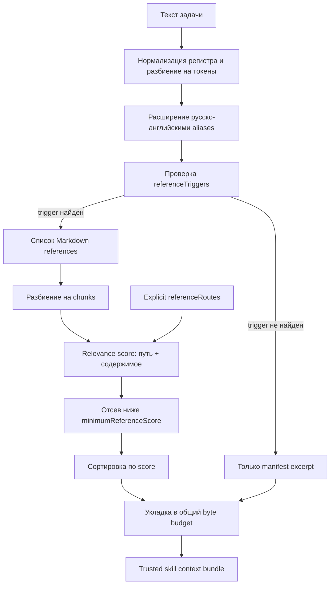
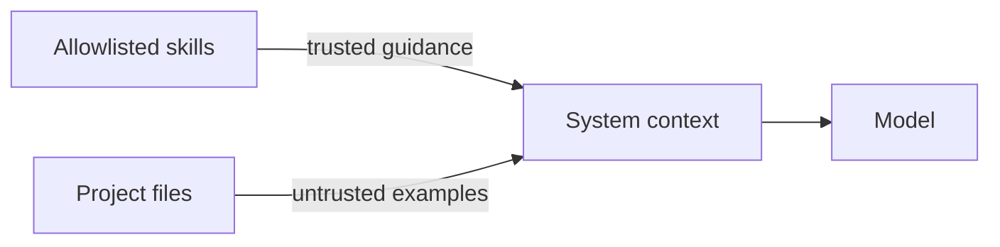

# Извлечение и сборка контекста

[Harness](README.md) · [Протокол модели](model-protocol.md) · [Evaluations](evaluations.md) · [Тезаурус](../glossary.md)

## Задача retrieval

Skills могут содержать десятки справочных файлов, а context window модели конечен. Retrieval должен выбрать небольшой набор фрагментов, которые с наибольшей вероятностью помогут решить конкретную задачу.

Текущая реализация — прозрачный лексический retriever. Она не использует embeddings или vector database. Это сознательный baseline: его легко объяснить, протестировать и отладить.

## Конвейер выбора



## Шаг 1. Чтение конфигурации

[`ai/harness.json`](../../ai/harness.json) определяет:

- `skillRoot` — корень внешних packages; по умолчанию `~/.agents/skills`;
- `skills` — allowlist имён и параметры каждого skill;
- `referenceTriggers` — фрагменты слов, включающие reference retrieval;
- `referenceRoutes` — прямое соответствие термина конкретному reference-файлу;
- `maxReferences` — максимум файловых фрагментов от skill;
- `retrieval.maxBytes` — общий бюджет trusted skill context;
- размеры manifest excerpts, chunks и исходных reference-файлов;
- `queryAliases` — двуязычные и синонимические расширения.

Путь с `~` разворачивается во время выполнения через домашний каталог текущего пользователя. Абсолютный пользовательский путь в Git не записывается.

## Шаг 2. Безопасное чтение skills

Context builder разрешает только каталоги, перечисленные в allowlist. Для файла дополнительно проверяется, что он:

- находится внутри ожидаемого skill directory;
- существует и является обычным файлом;
- не является symlink;
- не содержит NUL bytes, характерных для бинарных данных;
- не превышает установленный read limit без явного truncation.

Из каждого `SKILL.md` берётся компактный начальный excerpt. Он присутствует в каждом запросе, поэтому модель всегда знает назначение и базовые правила обоих skills.

## Шаг 3. Токены и aliases

Из запроса выделяются слова длиной не менее трёх символов. Частые общие слова вроде «сделать», `application`, `ionic` не помогают различать references и исключаются.

Затем aliases расширяют запрос. Например:

| Пользователь пишет | Дополнительные токены                                        |
| ------------------ | ------------------------------------------------------------ |
| `сигнал`           | `signal`, `signals`, `linked-signal`, `effects`              |
| `форм`             | `forms`, `reactive-forms`, `signal-forms`                    |
| `камера`           | `camera`, `photo`                                            |
| `уведомлен`        | `notifications`, `push-notifications`, `local-notifications` |
| `биометр`          | `biometric`, `capgo-plugin-catalog`                          |

Использование фрагментов слов позволяет сопоставлять русские падежи, но может давать ложные совпадения. Поэтому aliases и routes должны проверяться frozen eval-задачами.

## Шаг 4. Triggers и routes

`referenceTriggers` отвечают на вопрос: «Нужно ли вообще искать дополнительные references этого skill?» Например, запрос про HTTP включает Angular references; запрос про camera включает Capacitor references.

`referenceRoutes` дают сильный boost конкретному файлу. Запрос с `signal` направляется к `references/signals-overview.md`, а `camera` — к `references/capacitor-camera.md`. Это простой механизм контролируемого domain routing.

## Шаг 5. Chunking

Большой Markdown-файл делится по абзацам. Builder старается собирать соседние абзацы до `referenceChunkCharacters`; слишком длинный абзац режется на фиксированные части.

Chunk — не отдельное знание в весах модели, а фрагмент исходного текста. В bundle сохраняются его source path, порядковый номер, score, bytes и признак truncation. Это делает выбор наблюдаемым.

## Шаг 6. Scoring

Текущий score складывается из:

- совпадений токена в пути файла — вес высокий, потому что имя reference обычно хорошо описывает тему;
- совпадений в содержимом chunk — вес ниже;
- routing boost — очень высокий бонус для явно заданного соответствия.

Фрагменты ниже `minimumReferenceScore` отбрасываются. Оставшиеся сортируются по убыванию score, затем детерминированно по source и chunk number.

Это не семантический поиск: запрос «сохранить фото между сессиями» может требовать одновременно Camera и Filesystem, даже если буквальные слова распределены неудачно. Такие случаи добавляются в eval suite и затем улучшаются routes, aliases или новым retriever.

## Шаг 7. Бюджет

Manifest excerpts добавляются первыми. Если они уже не помещаются в бюджет, сборка останавливается с ошибкой: silently dropping базовых правил недопустим.

Затем лучшие candidates добавляются, пока соблюдаются:

- общий `maxBytes`;
- `maxReferences` каждого skill;
- лимит размера исходного reference;
- размер одного chunk.

Бюджет измеряется в bytes, а не в model tokens. Это простой и стабильный approximation, но разные языки и tokenizer дают разное отношение bytes/tokens. Поэтому при настройке context window нужно измерять реальные prompt tokens на model server.

## Project reference

По умолчанию application files не выбираются. Флаг `--with-project-reference` запускает отдельный поиск по tracked и untracked файлам допустимых расширений.

У project reference другая доверительная метка:



Из project context исключаются env files, credentials, signing materials, platform service configs, lockfiles, `AGENTS.md`, сам harness и generated artifacts. Дополнительно применяется redaction типичных литералов ключей, bearer tokens и private keys.

Redaction — дополнительная защита, а не основание отправлять секреты. Главная защита — исключение путей и opt-in.

## Диагностика

Посмотреть результат без обращения к модели:

```bash
npm run ai:context -- --query "Angular Signal Forms"
```

Сохранить bundle в ignored directory:

```bash
npm run ai:context -- --query "Capacitor geolocation permissions" \
  --output ai/generated/geolocation-context.json
```

При анализе проверяйте:

1. Оба manifest присутствуют.
2. Выбран правильный skill.
3. Source paths соответствуют теме.
4. Нет project files без explicit flag.
5. `totalBytes` не превышает budget.
6. В контексте нет credentials или deployment-specific данных.

## Когда переходить к embeddings

Vector retrieval стоит добавлять, когда frozen evals показывают устойчивые проблемы с синонимами, длинными вопросами или композиционными задачами, а aliases становятся трудно поддерживаемыми.

Даже после этого рекомендуется сохранить:

- allowlist источников;
- explicit routes для критических тем;
- byte/token budgets;
- source metadata;
- deterministic fallback;
- regression suite.

Embeddings улучшают поиск, но не заменяют policy и observability.

---

← [Harness](README.md) · [Документация](../README.md) · Далее: [протокол модели →](model-protocol.md)
