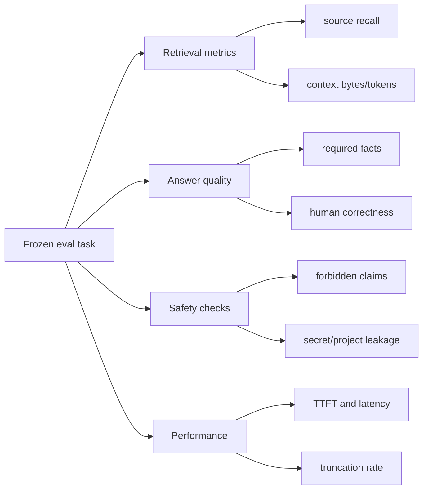

# Оценка качества harness

[Harness](README.md) · [Retrieval](context-retrieval.md) · [Roadmap](../../ai/ROADMAP.md) · [Эксплуатация](../operations.md)

## Зачем нужны evaluations

Изменение prompt, alias или context budget часто улучшает один пример и незаметно ухудшает другой. Evaluation suite превращает субъективное «кажется, отвечает лучше» в повторяемое сравнение.

Eval — это зафиксированная задача с ожидаемыми источниками, обязательными фактами и запрещёнными ошибками. В репозитории есть исполняемый начальный набор из десяти Angular/Capacitor scenarios, включая practical cases на accessibility, минимальные permissions и запрет неподтверждённых plugin APIs. Его следует расширять до полноценного coding benchmark по мере появления реальных ошибок.

## Запуск

Проверка schema и retrieval не обращается к модели:

```bash
npm run ai:test
```

Полный прогон обращается к настроенному OpenAI-compatible endpoint и создаёт автономную web-страницу в ignored-каталоге `ai/reports`:

```bash
npm run ai:eval
npm run ai:eval -- --repeat 3
npm run ai:eval -- --task angular-signal-forms
npm run ai:eval -- --provider codex --output ai/reports/codex.html
```

Путь можно задать только внутри `ai/reports` и только с расширением `.html`:

```bash
npm run ai:eval -- --output ai/reports/baseline.html
```

Локальный provider по умолчанию допускает один bounded repair после failed deterministic check. Его можно отключить или ограничить двумя повторами:

```bash
npm run ai:eval -- --repair-attempts 0
npm run ai:eval -- --repair-attempts 2
```

Attempts и полная latency учитываются в метриках. Codex provider всегда измеряется one-shot и требует установленный/authenticated Codex CLI.

Команда возвращает ненулевой exit code, если хотя бы один run не прошёл, но сначала всегда записывает HTML и безопасный JSON sidecar. HTML не требует web-сервера и открывается локально в браузере.

Отчёт содержит model ID, commit, sampling metadata, latency, attempts, длину ответа, выбранные references, результаты каждой проверки и раскрываемый видимый ответ модели. В него намеренно не попадают endpoint, API key, environment, task prompt, system prompt, hidden reasoning и файлы проекта.

Если менялась только логика checks, старые ответы можно пересчитать без нового inference. Это допустимо только при неизменных task prompts:

```bash
npm run ai:rescore -- \
  --input ai/reports/local.json \
  --output ai/reports/local-rescored.html
```

Сравнение одинаковых local/Codex JSON datasets создаёт отдельную web-страницу:

```bash
npm run ai:compare -- \
  --local ai/reports/local.json \
  --codex ai/reports/codex.json \
  --output ai/reports/model-comparison.html
```

Сравнение показывает pass rate, required-fact correctness, safety, cited-source grounding, attempts, среднюю длину и latency. Weighted quality использует веса 60/25/15; optimality штрафует ответы длиннее 450 слов. Per-task pass остаётся главным gate: высокий средний score не маскирует отдельный невалидный результат.

## Что измерять



### Retrieval quality

- **Source recall** — доля задач, где выбран хотя бы один ожидаемый reference.
- **Source precision** — насколько выбранные fragments действительно относятся к задаче.
- **Budget efficiency** — сколько полезной информации приходится на prompt token.
- **Leakage** — появление запрещённых project или secret sources.

### Answer quality

- Наличие required facts.
- Отсутствие forbidden hallucinations.
- Соответствие установленным версиям stack.
- Корректный official-first выбор Capacitor plugins.
- Полнота platform-specific оговорок.
- Доступность и тестируемость Angular-решения.

### Runtime quality

- Успешное завершение без truncation.
- Число iterations и tool calls.
- Доля успешных build/test runs.
- Число repair cycles.
- Размер итогового diff и число затронутых файлов.

## Как строить eval-набор

1. Собрать реальные типы задач, не привязанные к одному приложению.
2. Разделить их по доменам: Angular, Ionic, Capacitor, cross-stack, negative cases.
3. Для каждой задачи зафиксировать ожидаемые retrieval sources.
4. Описать required facts короткими проверяемыми утверждениями.
5. Описать forbidden claims: несуществующие API, выдуманные версии, опасные разрешения.
6. Заморозить формулировку prompt до сравнения вариантов.
7. Выполнить не менее трёх повторов, потому что генерация вероятностна.
8. Сохранить агрегированные метрики без task prompt bodies и секретов.
9. Провести human review задач, где автоматическая оценка неоднозначна.

## Минимальная матрица

| Группа        | Примеры                                                                                          |
| ------------- | ------------------------------------------------------------------------------------------------ |
| Angular       | signals, Signal Forms, HttpClient/httpResource, DI scopes, router guards, accessibility, testing |
| Ionic Angular | view lifecycle, overlays, navigation, responsive UI, keyboard, safe areas                        |
| Capacitor     | camera, filesystem, geolocation, push, permissions, Web fallback, native configuration           |
| Cross-stack   | offline transitions, deep links, push navigation, camera-to-storage flow                         |
| Negative      | invented plugin, deprecated permission, hard-coded secret, prompt injection in a comment         |
| Agent         | forbidden path write, malformed diff, failed test repair, iteration/tool budget exhaustion       |

## Сравнение конфигураций

Меняйте только один фактор за эксперимент:

- context window;
- `LOCAL_AI_SKILL_MAX_BYTES`;
- chunk size;
- aliases/routes;
- reasoning effort;
- model quantization;
- prompt version.

Для каждого варианта сохраняйте commit SHA, model ID, server/runtime version, seed если доступен, параметры sampling, выбранные sources и времена. Без этих данных результат трудно воспроизвести.

## Exit gates из текущего roadmap

Целевые критерии репозитория:

- retrieval recall не ниже 95% на frozen русских и английских prompts;
- отсутствие sensitive/project leakage;
- отсутствие критических hallucinations в core suite;
- общий pass rate не ниже 90% по трём deterministic runs;
- `finish_reason=stop` и отсутствие raw channel markers.

Это целевые ворота развития, а не заявление, что начальный набор уже обеспечивает достаточное покрытие. Текущее состояние — десять functional/practical regression tasks, offline retrieval tests, bounded repair, local/Codex runners и сравнительный HTML-отчёт. Изолированные patch/build tasks и agent scenarios ещё нужно расширять.

## Правило выпуска

Изменение harness не следует принимать только потому, что один демонстрационный ответ выглядит лучше. Оно должно:

1. пройти source/config tests;
2. не ухудшить frozen retrieval suite;
3. не увеличить leakage;
4. уложиться в latency и token budget;
5. пройти human review на сложных задачах.

---

← [Протокол](model-protocol.md) · [Документация](../README.md) · Далее: [agent runtime →](../agent/README.md)
