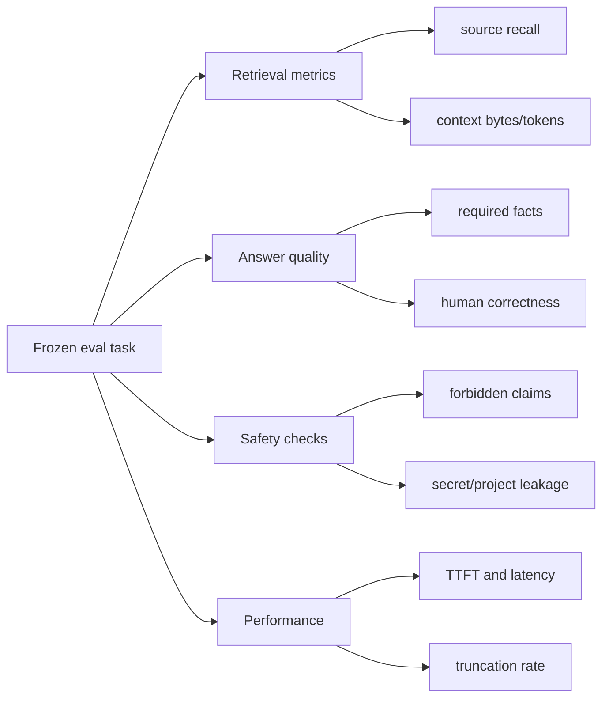

# Оценка качества harness

[Harness](README.md) · [Retrieval](context-retrieval.md) · [Roadmap](../../ai/ROADMAP.md) · [Эксплуатация](../operations.md)

## Зачем нужны evaluations

Изменение prompt, alias или context budget часто улучшает один пример и незаметно ухудшает другой. Evaluation suite превращает субъективное «кажется, отвечает лучше» в повторяемое сравнение.

Eval — это зафиксированная задача с ожидаемыми источниками, обязательными фактами и запрещёнными ошибками. Текущий репозиторий содержит начальный schema и две smoke-задачи; roadmap предусматривает расширение до полноценного benchmark.

## Что измерять

### Retrieval quality

- **Source recall** — доля задач, где выбран хотя бы один ожидаемый reference.
- **Source precision** — насколько выбранные fragments действительно относятся к задаче.
- **Budget efficiency** — сколько полезной информации приходится на prompt token.
- **Leakage** — появление запрещённых project или secret sources.

### Answer quality

- Наличие required facts.
- Отсутствие forbidden hallucinations.
- Соответствие установленным версиям stack.
- Корректный official-first выбор Capacitor plugins.
- Полнота platform-specific оговорок.
- Доступность и тестируемость Angular-решения.

### Runtime quality

- Успешное завершение без truncation.
- Число iterations и tool calls.
- Доля успешных build/test runs.
- Число repair cycles.
- Размер итогового diff и число затронутых файлов.

## Как строить eval-набор

1. Собрать реальные типы задач, не привязанные к одному приложению.
2. Разделить их по доменам: Angular, Ionic, Capacitor, cross-stack, negative cases.
3. Для каждой задачи зафиксировать ожидаемые retrieval sources.
4. Описать required facts короткими проверяемыми утверждениями.
5. Описать forbidden claims: несуществующие API, выдуманные версии, опасные разрешения.
6. Заморозить формулировку prompt до сравнения вариантов.
7. Выполнить не менее трёх повторов, потому что генерация вероятностна.
8. Сохранить агрегированные метрики без секретных prompt bodies.
9. Провести human review задач, где автоматическая оценка неоднозначна.

## Минимальная матрица

| Группа        | Примеры                                                                                          |
| ------------- | ------------------------------------------------------------------------------------------------ |
| Angular       | signals, Signal Forms, HttpClient/httpResource, DI scopes, router guards, accessibility, testing |
| Ionic Angular | view lifecycle, overlays, navigation, responsive UI, keyboard, safe areas                        |
| Capacitor     | camera, filesystem, geolocation, push, permissions, Web fallback, native configuration           |
| Cross-stack   | offline transitions, deep links, push navigation, camera-to-storage flow                         |
| Negative      | invented plugin, deprecated permission, hard-coded secret, prompt injection in a comment         |
| Agent         | forbidden path write, malformed diff, failed test repair, iteration/tool budget exhaustion       |

## Сравнение конфигураций

Меняйте только один фактор за эксперимент:

- context window;
- `LOCAL_AI_SKILL_MAX_BYTES`;
- chunk size;
- aliases/routes;
- reasoning effort;
- model quantization;
- prompt version.

Для каждого варианта сохраняйте commit SHA, model ID, server/runtime version, seed если доступен, параметры sampling, выбранные sources и времена. Без этих данных результат трудно воспроизвести.

## Exit gates из текущего roadmap

Целевые критерии репозитория:

- retrieval recall не ниже 95% на frozen русских и английских prompts;
- отсутствие sensitive/project leakage;
- отсутствие критических hallucinations в core suite;
- общий pass rate не ниже 90% по трём deterministic runs;
- `finish_reason=stop` и отсутствие raw channel markers.

Это целевые ворота развития, а не заявление, что расширенная suite уже реализована. Текущее состояние — два smoke tasks и unit/integration tests agent runtime.

## Правило выпуска

Изменение harness не следует принимать только потому, что один демонстрационный ответ выглядит лучше. Оно должно:

1. пройти source/config tests;
2. не ухудшить frozen retrieval suite;
3. не увеличить leakage;
4. уложиться в latency и token budget;
5. пройти human review на сложных задачах.

---

← [Протокол](model-protocol.md) · [Документация](../README.md) · Далее: [agent runtime →](../agent/README.md)
