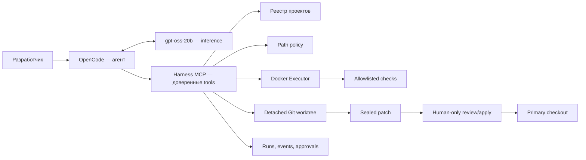

# Внешние проекты и OpenCode

[Документация](../README.md) · [Архитектура](../architecture.md) · [OpenCode](../opencode.md) · [Безопасность](../security.md) · [Worktree](../agent/worktrees-and-validation.md)

Этот режим позволяет использовать один установленный harness для нескольких Angular/Ionic/Capacitor-проектов. В целевой репозиторий не копируются `ai/`, `scripts/`, Docker-файлы, промпты, конфигурация OpenCode или состояние запусков.

OpenCode является единственным рассуждающим агентом. Harness не запускает второй модельный цикл: он предоставляет OpenCode узкие MCP-инструменты и механически контролирует каждое действие.

## Разделение ответственности



| Компонент       | Ответственность                                                                              | Чего он не делает                                                                        |
| --------------- | -------------------------------------------------------------------------------------------- | ---------------------------------------------------------------------------------------- |
| OpenCode        | Понимает задачу, загружает skills, выбирает MCP-инструменты и исправляет код по observations | Не читает проект напрямую, не запускает shell, не применяет результат к primary checkout |
| `gpt-oss-20b`   | Генерирует решения и вызовы инструментов                                                     | Не получает самостоятельных файловых или системных прав                                  |
| MCP server      | Связывает OpenCode с policy, worktree, state и Executor                                      | Не принимает модельное решение за OpenCode                                               |
| Docker Executor | Применяет patch и выполняет только команды профиля без сети                                  | Не выбирает произвольные команды из ответа модели                                        |
| Человек         | Одобряет точную protected capability и применяет sealed patch                                | Не выдаёт модели постоянное широкое разрешение                                           |

## Где хранятся данные

По умолчанию harness использует `${XDG_DATA_HOME}/ionic-llm-harness` или `~/.local/share/ionic-llm-harness`:

```text
ionic-llm-harness/
├── repositories.json
├── opencode-workspaces/
└── repositories/
    └── <repository-id>/
        ├── worktrees/<run-id>/
        ├── runs/<run-id>/
        │   ├── state.json
        │   └── events.jsonl
        └── approvals/<approval-id>.json
```

`repositories.json` создаёт локальную allowlist. MCP получает только `repository-id`, проверяет canonical realpath и не принимает путь, придуманный моделью. Физический worktree тоже находится во внешнем state root; основной каталог проекта остаётся неизменным до отдельной команды `apply`.

## Подготовка

Установите зависимости harness, настройте ignored `.env.local-ai` и соберите Docker image:

```bash
npm ci
npm run ai:doctor
npm run agent:docker:build
npm run agent:doctor
```

Целевой проект должен быть Git-репозиторием с чистым primary checkout, `package.json` и `package-lock.json`. Harness не монтирует macOS `node_modules` в Linux-контейнер: native packages такого дерева несовместимы с Executor.

Вместо этого создаётся project-specific runner image. Его identity — SHA-256 от `package.json`, `package-lock.json`, доверенного runner и Dockerfile. При первом использовании Docker выполняет `npm ci` в build context, содержащем только эти манифесты и runner; исходный код проекта туда не передаётся. Готовый image кэшируется по digest, а обычные patch/check containers продолжают работать без сети.

Image можно подготовить до запуска OpenCode:

```bash
npm run harness -- prepare /absolute/path/to/mobile-project
```

## Запуск OpenCode

```bash
npm run opencode -- --repo /absolute/path/to/mobile-project
```

Одноразовая задача:

```bash
npm run opencode -- \
  --repo /absolute/path/to/mobile-project \
  run "Добавь доступное пустое состояние списка"
```

Дополнительные параметры launcher:

| Параметр            | Назначение                                                              |
| ------------------- | ----------------------------------------------------------------------- |
| `--repo PATH`       | Целевой Git-репозиторий; по умолчанию используется этот boilerplate     |
| `--profile ID`      | Профиль policy/checks; default — `angular-ionic-capacitor`              |
| `--state-root PATH` | Внешний каталог state/worktrees; useful для отдельного encrypted volume |

Остальные arguments без изменений передаются OpenCode.

Launcher выполняет четыре защитных действия:

1. Регистрирует canonical Git root.
2. Запускает OpenCode из нейтрального каталога вне целевого проекта, поэтому project-local инструкции не получают автоматического доверия.
3. Через `OPENCODE_CONFIG_CONTENT` принудительно фиксирует LM Studio provider и запрет built-in tools.
4. Подключает локальный stdio MCP server с repository ID и profile ID.

## Инструменты модели

| MCP tool      | Назначение                                             | Основная защита                                                      |
| ------------- | ------------------------------------------------------ | -------------------------------------------------------------------- |
| `begin`       | Создать run и detached worktree от committed `HEAD`    | Требует чистый checkout; путь уже зарегистрирован человеком          |
| `list_files`  | Показать доступные файлы                               | Denied patterns исключаются до ответа модели                         |
| `search`      | Выполнить bounded literal search                       | Нет shell-синтаксиса; timeout и output budget                        |
| `read_file`   | Прочитать ограниченный диапазон текста                 | Traversal, symlink, binary, secret paths и oversized reads запрещены |
| `apply_patch` | Применить unified Git diff в worktree                  | Проверка path policy, размера, числа файлов и protected approval     |
| `git_diff`    | Показать текущий patch                                 | Bounded output; primary checkout не затрагивается                    |
| `run_checks`  | Запустить `fast`, `build` или `full`                   | Project runner по lockfile и versioned commands; container без сети  |
| `status`      | Прочитать persisted run state                          | Не изменяет репозиторий                                              |
| `finish`      | Выполнить mandatory full check и запечатать patch hash | Отклоняет изменение worktree во время проверки                       |

MCP намеренно не содержит `approve`, `apply`, `discard`, Git commit или Git push. Модель не может одобрить собственное изменение или перенести его в primary checkout.

## Protected approval

Если patch затрагивает `package.json`, Angular/Ionic/Capacitor configuration, native platform, CI, документацию harness или другую protected область, `apply_patch` возвращает `waiting_approval` с точными paths и approval ID.

Человек рассматривает запрос вне MCP и принимает решение:

```bash
npm run harness -- approve <repository-id> <approval-id> --actor <name>
# или
npm run harness -- reject <repository-id> <approval-id> --actor <name>
```

После одобрения OpenCode повторяет **тот же** patch. Approval связан с run ID, capability, SHA-256 аргументов, отсортированным набором protected paths и TTL. Изменённый patch не совпадёт с grant. После успешного использования approval получает состояние `consumed`.

## Завершение и применение

`finish` выполняет `requiredFinishCheck` из внешнего профиля. Профиль `angular-ionic-capacitor` запускает:

1. `format:check`, если script существует;
2. обязательную Angular build;
3. обязательные Unit-тесты без watch mode;
4. `cap:check`, если script существует.

Если проверка успешна и patch hash не изменился, run переходит в `ready`. Просмотреть patch:

```bash
npm run harness -- status <repository-id> <run-id> --include-patch
```

Применить его к clean primary checkout может только локальная CLI-команда:

```bash
npm run harness -- apply <repository-id> <run-id>
```

Перед применением повторно проверяются status, validation evidence, sealed patch hash, чистота checkout и неизменность primary `HEAD` относительно начала run. Harness применяет patch, но не выполняет commit или push.

Ненужный run можно удалить из Git worktree registry:

```bash
npm run harness -- discard <repository-id> <run-id>
```

## Проверка реализации

```bash
npm run harness:test
```

Тесты проверяют MCP tool surface, внешнее размещение worktree/state, регистрацию canonical repository, project-runner identity, read/patch lifecycle, sealed application и exact protected approval. Реальную сборку/проверку Docker можно включить командой `LOCAL_HARNESS_DOCKER_INTEGRATION=1 npm run harness:test`. Существующие 18 `agent:test` продолжают отдельно проверять встроенный model-loop runtime.

---

← [Harness](README.md) · [OpenCode →](../opencode.md)
