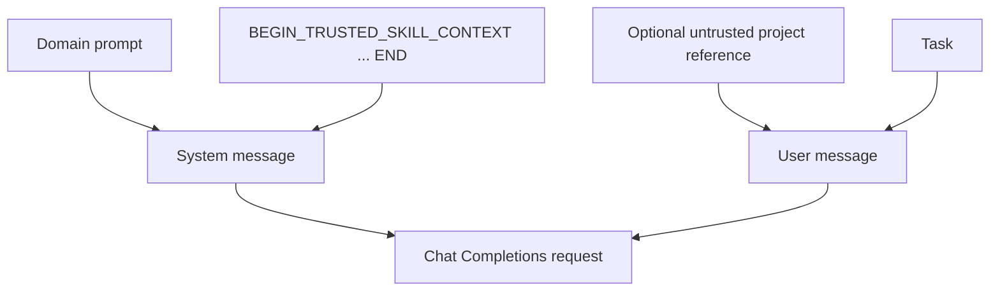
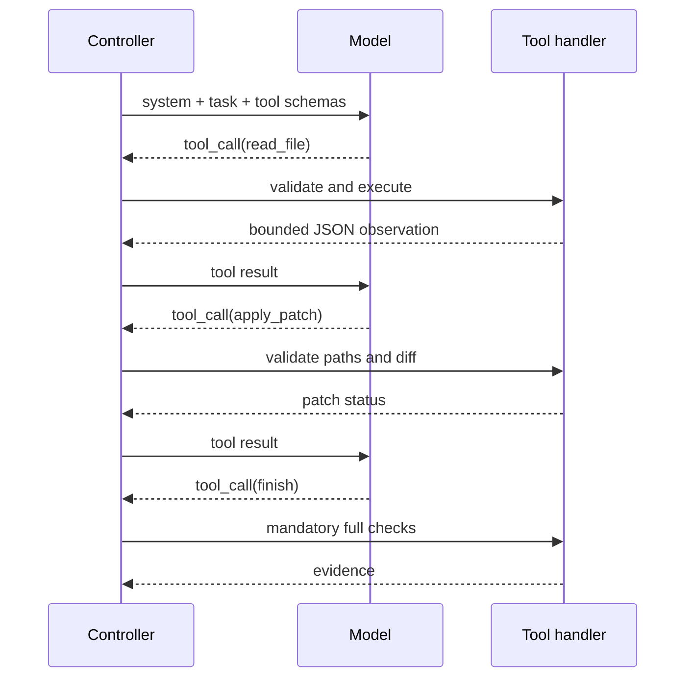

# Протокол взаимодействия с моделью

[Harness](README.md) · [Retrieval](context-retrieval.md) · [Agent runtime](../agent/README.md) · [Удалённое подключение](../../ai/remote-model.md)

## OpenAI-compatible — это контракт, а не поставщик

Model server предоставляет HTTP API, совместимый с Chat Completions. Это означает, что клиент отправляет массив сообщений и получает `choices[0].message`. Endpoint может находиться в LM Studio, за защищённым gateway или в другом совместимом runtime.

Репозиторий не фиксирует hostname, IP, SSH user или приватный порт. Локальные значения находятся в ignored `.env.local-ai`.

## Конфигурация соединения

| Переменная                  | Назначение                | Значение по умолчанию/ограничение                             |
| --------------------------- | ------------------------- | ------------------------------------------------------------- |
| `LOCAL_AI_BASE_URL`         | Базовый URL API с `/v1`   | Обязателен; только HTTP/HTTPS                                 |
| `LOCAL_AI_MODEL`            | Точный model ID           | Если не задан, клиент разрешает единственную доступную модель |
| `LOCAL_AI_API_KEY`          | Bearer token              | Необязателен только для доверенного локального контура        |
| `LOCAL_AI_TIMEOUT_MS`       | Timeout одного запроса    | 120000 мс, допустимо 1000–1800000                             |
| `LOCAL_AI_MAX_TOKENS`       | Maximum completion tokens | 4096                                                          |
| `LOCAL_AI_TEMPERATURE`      | Случайность генерации     | 0.1                                                           |
| `LOCAL_AI_REASONING_EFFORT` | Уровень reasoning         | `low`, также допустимы `medium`, `high`                       |
| `LOCAL_AI_SKILL_MAX_BYTES`  | Бюджет skill context      | 7200 bytes в текущем baseline                                 |

Секретные значения нельзя передавать через аргументы CLI, где они могут попасть в shell history. Используйте local env file или secret injection среды исполнения.

## Структура read-only сообщения



Явные маркеры доверия помогают модели различать инструкции и данные. Они не являются security boundary сами по себе; настоящую границу создаёт controller, который решает, что вообще попало в запрос.

## Ответ модели

Клиент принимает только ожидаемую структуру и проверяет критические признаки:

- в ответе есть completion message;
- `finish_reason` не равен `length`;
- content не содержит raw service-channel markers;
- пользователю возвращается visible content, а не скрытые reasoning fields.

Если `finish_reason=length`, ответ считается усечённым и отклоняется. Частичный патч или оборванная инструкция опаснее явной ошибки.

## Tool calling в агентном режиме

Agent request дополнительно содержит JSON schema каждого инструмента и параметры:

- `tool_choice: auto`;
- `parallel_tool_calls: false`;
- тот же model ID, temperature и token budget.

Предпочтительный ответ модели — native function tool call. Для совместимости runtime поддерживает строгий JSON fallback в `message.content`:

```json
{
  "tool": "read_file",
  "arguments": {
    "path": "src/app/app.ts"
  }
}
```

Fallback не означает, что произвольный JSON выполняется автоматически. Имя должно совпасть с registry, аргументы проверяются handler, а путь — policy.

## Многошаговый диалог



Controller повторно отправляет только видимые сообщения и результаты tools. Скрытые reasoning fields не сохраняются как часть диалога и не выводятся пользователю.

## Ошибки и восстановление

| Ошибка                      | Поведение                                                                       |
| --------------------------- | ------------------------------------------------------------------------------- |
| Endpoint недоступен         | Request завершается по timeout с понятной ошибкой                               |
| Model ID отсутствует        | Smoke/resolve останавливает запуск                                              |
| Tool arguments malformed    | Controller возвращает безопасную structured error, модель может исправить вызов |
| Нет tool call в agent mode  | Controller напоминает выбрать инструмент                                        |
| Неизвестный tool            | Вызов отклоняется                                                               |
| Ответ усечён                | Ответ отклоняется, budget нужно настроить                                       |
| Raw service markers         | Ответ отклоняется как ошибка template/parser                                    |
| Лимит tool calls/iterations | Run останавливается, worktree и log сохраняются для анализа                     |

## Удалённый endpoint

Минимальный production-контур должен обеспечивать TLS, authentication, ограничения размера запроса, rate limiting, timeout и audit metadata без записи prompt body по умолчанию. Подробный план: [deployment-тестирование и hardening](../deployment-and-hardening.md).

---

← [Retrieval](context-retrieval.md) · [Документация](../README.md) · Далее: [evaluations →](evaluations.md)
