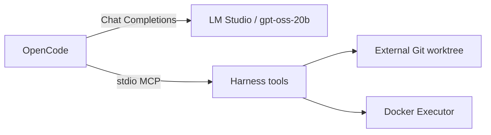

# OpenCode, MCP harness и удалённая модель

[Документация](README.md) · [Внешние проекты](harness/external-projects-and-opencode.md) · [Удалённая модель](../ai/remote-model.md) · [Безопасность](security.md)

OpenCode используется как единственный reasoning agent. Он обращается к `gpt-oss-20b` через OpenAI-compatible endpoint, загружает global skills и работает с целевым Git-репозиторием только через локальный MCP server harness.

## Два независимых соединения



Model endpoint выполняет inference. MCP server предоставляет действия над проектом. Успешное соединение с моделью не означает, что MCP или Docker готовы, и наоборот.

## Локальная конфигурация модели

Создайте ignored файл, если он ещё не подготовлен:

```bash
cp .env.local-ai.example .env.local-ai
```

Заполните provider-neutral значения:

```dotenv
LOCAL_AI_BASE_URL=https://model.example.com/v1
LOCAL_AI_MODEL=gpt-oss-20b
LOCAL_AI_API_KEY=<token-if-required>
```

Проверьте endpoint и Docker:

```bash
npm run ai:doctor
npm run ai:smoke
npm run agent:docker:build
npm run agent:doctor
```

## Запуск

Для текущего boilerplate:

```bash
npm run opencode
```

Для другого проекта без переноса harness-файлов:

```bash
npm run opencode -- --repo /absolute/path/to/project
```

Launcher загружает `.env.local-ai`, регистрирует целевой Git root, создаёт нейтральный OpenCode workspace во внешнем state root и передаёт обязательную inline-конфигурацию. Project-local `opencode.json` целевого репозитория не может вернуть прямые файловые полномочия, потому что OpenCode вообще не запускается из этого project tree, а enforced config загружается с более высоким приоритетом.

## Разрешения

Enforced policy использует deny-by-default:

```json
{
  "permission": {
    "*": "deny",
    "skill": "allow",
    "question": "allow",
    "todowrite": "allow",
    "doom_loop": "ask",
    "ionic_harness_*": "allow"
  }
}
```

Встроенные `read`, `edit`, `apply_patch`, `bash`, LSP и external-directory tools не разрешены. Это принципиальное отличие от прежнего режима `edit: ask` / `bash: ask`: подтверждение OpenCode больше не является границей безопасности. Protected approval реализует сам harness и не отдаёт инструмент решения модели.

## Skills

OpenCode автоматически обнаруживает совместимые global skills в `~/.agents/skills`. Агент загружает `angular-developer` и `capacitor-plugins` по необходимости; копировать их в проект не нужно.

## Диагностика

Проверить resolved model configuration:

```bash
npm run opencode:config
```

Проверить модель:

```bash
npm run opencode:models
```

Проверить MCP implementation независимо от OpenCode:

```bash
npm run harness:test
```

### `LOCAL_AI_BASE_URL is not configured`

Создайте `.env.local-ai` в репозитории harness. Не добавляйте endpoint или token в Git.

### OpenCode не найден

Установите OpenCode официальным способом или задайте `OPENCODE_BIN`. Launcher не устанавливает и не обновляет binary.

### MCP server не запускается

Выполните `npm ci` в harness и `npm run harness:test`. Проверьте, что целевой путь является доступным Git-репозиторием.

### Checks не запускаются

Соберите base runner командой `npm run agent:docker:build`, запустите Docker daemon и проверьте наличие `package-lock.json`. Для диагностики project-specific image выполните `npm run harness -- prepare /path/to/project`. Сеть используется только во время контролируемой сборки dependency image; исполняемые checks сети не получают.

### Protected patch остановился

Это ожидаемое состояние. Используйте repository ID и approval ID из результата для локальной команды `npm run harness -- approve ...`, затем попросите OpenCode повторить идентичный patch.

---

← [Эксплуатация](operations.md) · [Внешние проекты →](harness/external-projects-and-opencode.md)
