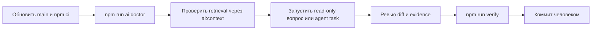

# Эксплуатация и диагностика

[Документация](README.md) · [Быстрый старт](getting-started.md) · [Безопасность](security.md) · [Deployment-hardening](deployment-and-hardening.md)

## Повседневный цикл



## Справочник команд

| Команда                               | Назначение                             |              Обращается к модели |                   Меняет source files |
| ------------------------------------- | -------------------------------------- | -------------------------------: | ------------------------------------: |
| `npm start`                           | Angular dev server                     |                              нет |                                   нет |
| `npm run build`                       | Production Angular build               |                              нет |                                   нет |
| `npm test -- --watch=false`           | Unit tests один раз                    |                              нет |                                   нет |
| `npm run cap:doctor`                  | Проверка Capacitor                     |                              нет |                                   нет |
| `npm run docs:check`                  | Проверка внутренних Markdown links     |                              нет |                                   нет |
| `npm run ai:doctor`                   | Проверка skills/config/routing         |                              нет |                                   нет |
| `npm run ai:context -- --query "..."` | Показать выбранный context bundle      |                              нет |    только с `--output` в ignored path |
| `npm run ai:smoke`                    | Проверка endpoint/model response       |                               да |                                   нет |
| `npm run ai:ask -- "..."`             | Read-only консультация                 |                               да |                                   нет |
| `npm run agent:doctor`                | Проверка agent prerequisites/isolation |                              нет |                                   нет |
| `npm run agent:test`                  | Tests policy/protocol/tools/runtime    | mock endpoint в integration test |                    временные fixtures |
| `npm run agent -- "..."`              | Изменение в isolated worktree          |                               да |                       только worktree |
| `npm run agent -- "..." --apply`      | То же + применение успешного patch     |                               да |                      да, после checks |
| `npm run verify`                      | Полный repository gate                 |       нет для source-only checks | build artifacts по правилам toolchain |

## Конфигурация модели

Локальный ignored файл `.env.local-ai` загружается автоматически. После изменения конфигурации запускайте:

```bash
npm run ai:doctor
npm run ai:smoke
```

Если server видит несколько моделей, задайте точный `LOCAL_AI_MODEL`. Если endpoint удалённый, используйте TLS и token. Provider-neutral примеры находятся в [`ai/remote-model.md`](../ai/remote-model.md).

## Диагностика плохого ответа

Идите снизу вверх, не меняя сразу prompt и модель:

1. Выполните `ai:context` с той же формулировкой.
2. Проверьте tokens, selected sources и budget.
3. Если source неверный — исправьте alias/route/eval.
4. Если source верный, но фрагмент обрезан — измерьте chunk/context budget.
5. Если context корректен — проверьте system prompt и task clarity.
6. Сравните ответ на frozen task с теми же sampling parameters.
7. Только затем меняйте reasoning effort, context window или модель.

## Диагностика agent run

Runtime печатает run ID и worktree path. Журнал:

```bash
sed -n '1,240p' .agent/runs/<run-id>/events.jsonl
```

Для удобства используйте `jq`, если он установлен:

```bash
jq -c '{timestamp, type, iteration, tool, result}' \
  .agent/runs/<run-id>/events.jsonl
```

Не прикладывайте полный log к публичной issue: сначала проверьте task text, patches и model output на чувствительные данные.

## Типовые проблемы

### `Required skill is missing`

Проверьте, что существуют:

```text
~/.agents/skills/angular-developer/SKILL.md
~/.agents/skills/capacitor-plugins/SKILL.md
```

Для другого расположения задайте `LOCAL_AI_SKILL_ROOT`, не изменяя versioned config под конкретного пользователя.

### `The primary worktree must be clean`

Agent intentionally не смешивает изменения. Закончите текущую работу: commit или осознанный stash. Не используйте destructive reset ради запуска агента.

### `No supported process sandbox is available`

Это означает, что checks не будут запущены на host автоматически. Предпочтительный путь — контейнер/VM. Явный `--allow-host-execution` допустим только если среда уже изолирована и вы принимаете риск выполнения versioned check scripts.

### Ответ усечён

Увеличьте `LOCAL_AI_MAX_TOKENS` измеренно. Одновременно проверьте, не переполнен ли prompt нерелевантным context. Увеличение output budget не исправляет плохой retrieval.

### Модель не вызывает tools

Проверьте поддержку tool calling в server template. Runtime отправит напоминание и поддерживает JSON fallback, но repeated failure указывает на несовместимый chat template или модель.

### Full checks слишком медленные

Во время работы модель может выбирать `fast`/`build`, но `finish` всегда требует `full`. Ускоряйте caching и CI runner; не ослабляйте finish gate без evidence.

## Maintenance cadence

### При обновлении stack

1. Обновить packages и lockfile человеком или protected run.
2. Проверить официальные migration guides.
3. Обновить `AGENTS.md`, prompts и skills при изменении conventions.
4. Запустить `npm run verify` и расширенные native checks.
5. Добавить regression eval для обнаруженной несовместимости.

### При обновлении skill

1. `ai:doctor`.
2. Несколько representative `ai:context` запросов.
3. Frozen retrieval suite.
4. Answer quality runs.
5. Review выросшего context size и новых external references.

### При изменении tool/policy

1. Threat model review.
2. Negative unit tests на обход.
3. Runtime integration test с mock endpoint.
4. Container/sandbox test.
5. Документация и version bump schema при несовместимом изменении.

## Очистка runs

Проект пока не удаляет старые `.agent/runs` и worktrees автоматически. Перед очисткой:

1. Убедитесь, что нужный diff принят или сохранён.
2. Проверьте `git worktree list`.
3. Удалите конкретный старый worktree через `git worktree remove <exact-path>`.
4. Удалите соответствующий run directory по принятой retention policy.
5. Выполните `git worktree prune` только для stale registrations.

Не используйте широкие recursive delete targets и unresolved variables.

---

← [Безопасность](security.md) · [Документация](README.md) · Далее: [deployment-hardening →](deployment-and-hardening.md)
