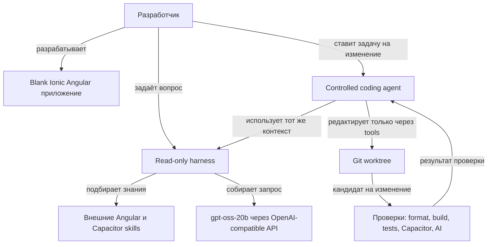

# Обзор проекта

[Документация](README.md) · [Быстрый старт](getting-started.md) · [Архитектура](architecture.md) · [Тезаурус](glossary.md)

## Зачем нужен этот репозиторий

`ionic-llm-boilerplate` — нейтральная стартовая площадка для двух связанных задач:

1. Разрабатывать приложения на Angular, Ionic и Capacitor.
2. Давать локальной модели достаточно знаний и строго ограниченных возможностей, чтобы она могла помогать с кодом предсказуемо и проверяемо.

Репозиторий намеренно не содержит бизнес-логики конкретного продукта. Это позволяет применять его как шаблон: добавить предметную область можно позже, не смешивая её с базовой инфраструктурой для ИИ.

## Из каких частей состоит система

### Приложение

Это минимальная standalone-основа Angular 22 с Ionic Angular 8 и пакетами Capacitor 8. Каталоги `android/` и `ios/` не генерируются заранее: они появляются только тогда, когда проект действительно выбирает соответствующую платформу.

### Read-only harness

[Harness](harness/README.md) загружает внешние skills, извлекает релевантные фрагменты, добавляет системные правила и отправляет подготовленный запрос модели. Команда `ai:ask` ничего не меняет в репозитории. Она подходит для объяснений, проектирования и ревью идей.

### Controlled coding agent

[Agent runtime](agent/README.md) добавляет к harness цикл инструментов. Модель может исследовать разрешённые файлы, предложить унифицированный Git-патч и запросить проверки. Контроллер, а не модель, решает, допустима ли операция.

### Skills

Skill — это пакет инструкций и справочных материалов для определённой области. В текущей compact retrieval конфигурации разрешены четыре skills:

- `angular-developer` — архитектура Angular, signals, формы, HTTP, маршрутизация, тестирование и доступность;
- `capacitor-plugins` — выбор официальных и резервных плагинов, платформенные разрешения и нативные возможности.
- `ionic-native-essentials` — типовые official Capacitor integrations для Ionic;
- `ionic-deep-links` — URL schemes, Universal Links и Android App Links.

Skills не копируются в репозиторий. Harness читает актуальные версии из `~/.agents/skills` при каждом запросе. OpenCode дополнительно выбирает task-specific skills из двух полностью установленных Ionic/Capgo repository packages.

## Что система умеет сейчас

- Подключаться к `gpt-oss-20b` через OpenAI-compatible Chat Completions endpoint.
- Подбирать task-specific контекст из четырёх allowlisted skills.
- Понимать русские и английские термины маршрутизации.
- Опционально добавлять файлы текущего проекта как **недоверенный** пример.
- Отделять простой вопрос к модели от задачи с изменением кода.
- Запускать агентные задачи в отдельном Git worktree.
- Ограничивать чтение, запись, размер патча, число файлов, tool calls и итерации.
- Защищать конфигурацию, нативные каталоги, секреты и Git metadata.
- Запускать только заранее описанные профили проверок.
- Возвращать ошибки проверок модели для ограниченной попытки исправления.
- Сохранять локальный журнал событий с ограниченными правами доступа.
- Применять итоговый патч к основной рабочей копии только по явному флагу `--apply`.
- Исполнять patch/check операции в no-network Docker-контейнере по умолчанию.
- Ставить run на паузу для точечного approval и продолжать после перезапуска CLI.
- Принимать review-only удалённые задачи через token-protected loopback Agent API.

## Чего система не делает

- Не обучает и не изменяет веса модели.
- Не превращает любой текст модели в shell-команду.
- Не даёт модели произвольный доступ к файловой системе или сети.
- Не гарантирует корректность ответа без проверок и ревью человеком.
- Не является multi-tenant production control plane с OIDC, durable queue и repository authorization.
- Не создаёт Android/iOS проекты, пока это явно не требуется.
- Не отправляет приложение в контекст модели по умолчанию.

## Основной принцип

Модель рассматривается как вероятностный компонент, который предлагает следующий шаг. Все полномочия находятся у детерминированного контроллера:

> **Модель предлагает; harness даёт контекст; policy разрешает или запрещает; инструменты исполняют; проверки доказывают.**

Это и есть центральная идея проекта. Подробно она разобрана в [архитектуре](architecture.md) и [разделе о безопасности](security.md).

---

← [Документация](README.md) · Далее: [быстрый старт →](getting-started.md)
